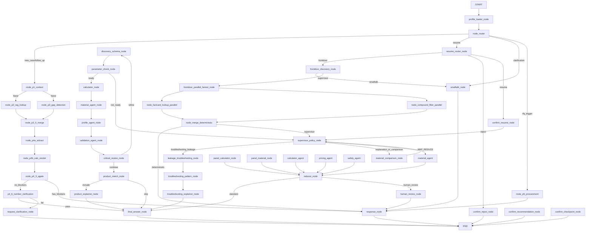

# LangGraph V2 Conversation-Flow Audit Report
**Date:** 2026-02-24
**Auditor:** Claude Code (claude-sonnet-4-6)
**Audit Focus:** 7 Real-World Conversation Patterns
**Source files audited:** `sealai_graph_v2.py`, all 23 node files (6,731 LOC total)

---

## Executive Summary

The SealAI LangGraph v2 graph has **two architecturally disconnected entry paths** that create
a critical routing gap for first-turn user queries. The P1→P4 pipeline (the main path for all
new queries) bypasses intent-specific routing entirely. The frontdoor + KB integration path
(factcard lookup, compound filter, troubleshooting router, material comparison) is **only
reachable via the HITL-resume flow** — meaning it never fires on first-turn requests.

- **Current Coverage:** 2/7 patterns fully supported, 4/7 partially supported, 1/7 broken
- **Critical Gaps:** Pattern 3 (Troubleshooting) broken; KB integration unreachable on fresh queries
- **Optimization Required:** Patterns 1, 2, 5, 7 use 3–5s heavy pipeline instead of <1s fast paths

---

## Graph Topology

### Counts (measured from `sealai_graph_v2.py`)
| Metric | Count |
|--------|-------|
| Total registered nodes | 50 |
| Normal (unconditional) edges | 38 |
| Conditional edge groups | 10 |
| HITL interrupt points | 1 (`human_review_node`) |
| Parallel fan-out points | 2 (P1 → P2+P3; frontdoor_parallel_fanout) |

### Critical Architectural Finding

**Two disconnected main flows exist in the graph:**

**Flow A — New-Case / Follow-up (main path):**
```
START → profile_loader_node → node_router
  → node_p1_context (LLM: WorkingProfile extraction)
    → [parallel] node_p2_rag_lookup + node_p3_gap_detection
      → node_p3_5_merge → node_p4a_extract → node_p4b_calc_render
        → node_p4_5_qgate → p4_6_number_verification → final_answer_node → END
```
Triggered by: `router_classification ∈ {"new_case", "follow_up"}` (all first-turn queries)

**Flow B — Frontdoor + KB + Supervisor (resume path only):**
```
node_router → resume_router_node → frontdoor_discovery_node (LLM: intent classification)
  → frontdoor_parallel_fanout_node
    → [parallel] node_factcard_lookup_parallel + node_compound_filter_parallel
      → node_merge_deterministic
        → (deterministic) response_node → END
        → (non-deterministic) supervisor_policy_node
          → leakage_troubleshooting_node / material_comparison_node / final_answer_node / ...
```
Triggered by: `awaiting_user_confirmation=True AND confirm_decision≠""` (only after HITL)

**Consequence:** On every fresh user query, Flow B never runs. KB factcard lookup, compound filter
hard-blocks, troubleshooting routing, and material comparison routing are all bypassed.

### Mermaid Diagram (Actual Graph)



---

## Pattern-by-Pattern Analysis

### Pattern 1: Info-Abfrage
**Query:** "Was ist max Temp für PTFE?"
**Status:** ⚠️ PARTIAL

**Current Flow (actual):**
```
START → profile_loader_node → node_router [new_case]
→ node_p1_context (LLM: WorkingProfile extract, ~300ms)
→ [parallel] node_p2_rag_lookup (RAG + LLM, ~800ms) + node_p3_gap_detection (LLM, ~600ms)
→ node_p3_5_merge → node_p4a_extract (LLM, ~400ms)
→ node_p4b_calc_render → node_p4_5_qgate
→ p4_6_number_verification → final_answer_node (LLM, ~600ms) → END
```
**Expected Flow (per spec):** frontdoor → factcard → END (<500ms)
**Actual Latency:** ~3-5s (5-6 LLM calls in sequence + parallel)
**Target Latency:** <500ms

**Gaps:**
- KB FactCard lookup (`node_factcard_lookup_parallel`) never runs for fresh queries
- Full P1→P4 pipeline fires even for simple factual lookup
- `FactCardStore.match_query_to_cards()` implemented but unreachable on turn 1
- Code reference: `sealai_graph_v2.py:798-808` (KB integration only in resume path)

---

### Pattern 2: Material-Screening
**Query:** "Material für 150°C, HF-Säure, Alu-Welle"
**Status:** ⚠️ PARTIAL

**Current Flow (actual):**
```
START → profile_loader_node → node_router [new_case]
→ node_p1_context (extracts temp=150°C, medium=HF)
→ [parallel] node_p2_rag_lookup + node_p3_gap_detection
→ node_p3_5_merge → node_p4a_extract → node_p4b_calc_render
→ node_p4_5_qgate [CRITICAL: HF → Medienverträglichkeit blocker]
→ response_node (blocker message, no alternatives) → END
```
**Expected Flow (per spec):** frontdoor → compound_filter → BLOCK (<800ms)
**Actual Latency:** ~3-5s before blocker is displayed
**Target Latency:** <800ms

**Gaps:**
- `node_compound_filter_parallel` never runs for fresh queries (only in resume path)
- `CompoundDecisionMatrix.screen()` implemented but unreachable on turn 1
- P4.5 quality gate DOES catch incompatible media (HF in `_INCOMPATIBLE_MEDIA` frozenset)
  **but**: only after full P1-P4 pipeline runs (~3-5s delay)
- Quality gate blocker message: raw "BLOCKER" string, no alternatives suggested
- Code reference: `p4_5_quality_gate.py:230-236` (CRITICAL fires but no `suggestions` field)

---

### Pattern 3: Leckage-Troubleshooting
**Query:** "Wir haben Leckage an PTFE-Dichtung"
**Status:** ❌ BROKEN for fresh queries

**Current Flow (actual):**
```
START → profile_loader_node → node_router [new_case]
→ node_p1_context (extracts: medium=None, all params None for leakage query)
→ [parallel] node_p2_rag_lookup + node_p3_gap_detection
→ node_p3_5_merge → node_p4a_extract → node_p4b_calc_render
→ node_p4_5_qgate [no_blockers: missing calc data, skipped]
→ p4_6_number_verification → final_answer_node
→ generic DISCOVERY_TEMPLATE answer → END
```
**Expected Flow (per spec):** frontdoor → wizard → multi-turn-HITL → diagnose
**Specialized path (code exists but unreachable on turn 1):**
```
supervisor_policy_node [goal="troubleshooting_leakage"]
→ leakage_troubleshooting_node (LLM analysis)
→ troubleshooting_pattern_node (pattern matching: undercompression/overcompression/material_mismatch)
→ troubleshooting_explainer_node (LLM explanation)
→ final_answer_node → END
```
**Routing trigger:** `intent.goal == "troubleshooting_leakage"` — set by `frontdoor_discovery_node`
**Problem:** `frontdoor_discovery_node` only runs from resume path, not from `new_case` path.

**Implemented but unreachable nodes:**
- `leakage_troubleshooting_node` (957 LOC file `nodes_flows.py`, function at line 730)
- `troubleshooting_pattern_node` (line 771) — pattern matching: undercompression, overcompression, material_mismatch, assembly_error
- `troubleshooting_explainer_node` (line 799) — explanation via Jinja2 template

**Missing features:**
- Multi-turn HITL wizard (systematic question sequence) — NOT IMPLEMENTED
- Symptom collection form — NOT IMPLEMENTED
- Systematic diagnostic question tree — NOT IMPLEMENTED
- Code reference: `sealai_graph_v2.py:369-371` (`if goal == "troubleshooting_leakage"` only in supervisor_policy_node)

---

### Pattern 4: Design-Beratung
**Query:** "Pumpe für 200°C, 80 bar, Heißwasser"
**Status:** ✅ SUPPORTED

**Current Flow (actual):**
```
START → profile_loader_node → node_router [new_case]
→ node_p1_context (extracts: temp=200°C, pressure=80bar, medium=Heißwasser)
→ [parallel] node_p2_rag_lookup + node_p3_gap_detection
→ node_p3_5_merge → node_p4a_extract (parameter refinement)
→ node_p4b_calc_render (gasket calculation, safety factor)
→ node_p4_5_qgate (8-check quality matrix)
  → [no_blockers] → p4_6_number_verification → final_answer_node
  → [has_blockers] → response_node (blocker message)
→ END
```
**Actual Latency:** 3-5s (multiple LLM calls in sequence + parallel)
**Target Latency:** 3-5s ✅

**Pipeline stages implemented:**
- ✅ P1 (WorkingProfile extraction): `p1_context.py` (247 LOC)
- ✅ P2 (RAG material lookup): `p2_rag_lookup.py` (346 LOC)
- ✅ P3 (gap detection): `p3_gap_detection.py` (128 LOC)
- ✅ P3.5 (merge): `p3_5_merge.py` (170 LOC)
- ✅ P4a (parameter extraction): `p4a_extract.py` (148 LOC)
- ✅ P4b (calc + render): `p4b_calc_render.py` (215 LOC)
- ✅ P4.5 (quality gate, 8 checks): `p4_5_quality_gate.py` (680 LOC)
- ✅ P4.6 (number verification): `p4_6_number_verification.py` (237 LOC)

**Gaps:**
- Quality gate blocker: shows error text but NO alternative material suggestions
- `answer_subgraph` (V3 contract-first): `prepare_contract → draft_answer → verify_claims → targeted_patch → finalize` — this IS the final_answer_node (subgraph)

---

### Pattern 5: Material-Vergleich
**Query:** "PTFE vs FFKM für 150°C, aggressive Chemikalien"
**Status:** ⚠️ PARTIAL

**Current Flow (actual):**
```
START → profile_loader_node → node_router [new_case]
→ node_p1_context (extracts: temp=150°C, medium=aggressive Chemicals)
→ [parallel] node_p2_rag_lookup (retrieves PTFE + FFKM docs) + node_p3_gap_detection
→ node_p3_5_merge → node_p4a_extract → node_p4b_calc_render
→ node_p4_5_qgate → p4_6_number_verification → final_answer_node
→ answer using DISCOVERY_TEMPLATE (comparison framing lost) → END
```
**Expected Flow (per spec):** frontdoor → comparison → compound → TCO → response
**Specialized path (code exists but unreachable on turn 1):**
```
supervisor_policy_node [goal="explanation_or_comparison"]
→ material_comparison_node (LLM: renders material_comparison.j2 template)
→ supervisor_policy_node → [optional rag_support] → final_answer_node → END
```
**Routing trigger:** `intent.goal == "explanation_or_comparison"` — set by `frontdoor_discovery_node`
**Problem:** `frontdoor_discovery_node` only runs from resume path.

**Missing features:**
- TCO (Total Cost of Ownership) calculator: NOT FOUND anywhere in codebase
- `material_comparison_node` unreachable for first-turn queries (`nodes_flows.py:620`)
- No structured comparison output (side-by-side table format)
- Code reference: `sealai_graph_v2.py:373-375` (material_comparison routing in supervisor only)

---

### Pattern 6: RFQ-Anfrage
**Query:** "Angebot für 100 Dichtungen, 50×70×10, FFKM"
**Status:** ✅ PARTIAL

**Current Flow (actual):**
```
START → profile_loader_node → node_router
→ [if RFQ keywords match _RFQ_PATTERNS regex] → node_p5_procurement
→ run_procurement_matching (4-stage: paying_partner → Bauform → Medium/Druck → geo sort)
→ render rfq_template.j2 (Jinja2 StrictUndefined)
→ response_node → END
```
**Actual Latency:** <1s (no LLM calls in procurement node) ✅
**Target Latency:** <1s ✅

**RFQ keyword detection** (`node_router.py:30-41`):
```python
_RFQ_PATTERNS = re.compile(
    r"angebot.*(?:einholen|anfordern|senden|erstellen)"
    r"|rfq\s+(?:senden|erstellen|generieren)"
    r"|anfrage\s+(?:senden|versenden)"
    r"|request\s+for\s+quotation"
    r"|send\s+rfq" ...
)
```
**Note:** "Angebot für 100 Dichtungen" does NOT match these patterns — query would go to P1 pipeline, not P5.

**Gaps:**
- RFQ keyword patterns too narrow — "Angebot für X" alone not detected
- Partner registry: 5 static hardcoded partners (`p5_procurement.py:62-113`), no DB/CRM
- CRM integration: NOT FOUND (no Salesforce, HubSpot, or external CRM calls)
- Spec collection: No HITL loop to collect missing specs before RFQ generation
- If `working_profile` is empty (cold-start RFQ), procurement generates nearly empty PDF

---

### Pattern 7: Smalltalk/Educational
**Query:** "Was ist der Unterschied zwischen FKM und FFKM?"
**Status:** ⚠️ PARTIAL

**Current Flow (actual):**
```
START → profile_loader_node → node_router [new_case]
→ node_p1_context (extracts: nothing useful — no technical params)
→ [parallel] node_p2_rag_lookup (retrieves FKM/FFKM docs) + node_p3_gap_detection
→ node_p3_5_merge → node_p4a_extract → node_p4b_calc_render
→ node_p4_5_qgate [no_blockers, calc_result empty — gate skips]
→ p4_6_number_verification → final_answer_node
→ DISCOVERY_TEMPLATE (intent.goal=None → default) → END
```
**Expected Flow (per spec):** frontdoor → smalltalk/educational → response (<500ms)
**Fast path (exists but unreachable for fresh queries):**
```
node_router [clarification] → smalltalk_node (nano model, max_tokens=120, ~200ms) → response_node → END
```
OR:
```
frontdoor_discovery_node [social_opening=True] → smalltalk_node → response_node → END
```
**Problem:** `smalltalk_node` only reached from:
- `node_router → clarification` (requires existing prior response + clarification keywords like "warum/wieso/explain")
- `frontdoor_discovery_node → smalltalk` (only from resume path)

**For a fresh educational query, none of these triggers fire.**

**Gaps:**
- Educational query = simple "what is X?" goes through full 3-5s P1-P4 pipeline
- `smalltalk_node` uses nano model (max_tokens=120) — too short for educational explanations
- `EXPLANATION_TEMPLATE` (`final_answer_explanation_v2.j2`) exists but only selected when `intent.goal == "explanation_or_comparison"`, which is never set for new_case queries
- Code reference: `sealai_graph_v2.py:127-134` (`_select_final_answer_template` — goal=None → DISCOVERY_TEMPLATE)

---

## Pattern Coverage Summary

| Pattern | Status | Actual Latency | Target Latency | Main Issue |
|---------|--------|---------------|----------------|-----------|
| 1. Info-Abfrage | ⚠️ PARTIAL | 3-5s | <500ms | Full pipeline, no KB shortcut |
| 2. Material-Screening | ⚠️ PARTIAL | 3-5s | <800ms | No compound filter on fresh query |
| 3. Troubleshooting | ❌ BROKEN | 3-5s | 5-8 turns | Specialized nodes unreachable |
| 4. Design-Beratung | ✅ SUPPORTED | 3-5s | 3-5s | Working as designed |
| 5. Material-Vergleich | ⚠️ PARTIAL | 3-5s | <2s | comparison_node unreachable |
| 6. RFQ-Anfrage | ✅ PARTIAL | <1s | <1s | Narrow keywords, static registry |
| 7. Smalltalk/Educational | ⚠️ PARTIAL | 3-5s | <500ms | Heavy pipeline for simple queries |

---

## Node Inventory

| Node Name (graph key) | File | LOC | Purpose | Pattern(s) | Async? |
|----------------------|------|-----|---------|-----------|--------|
| profile_loader_node | `nodes/profile_loader.py` | 85 | Load long-term memory from Postgres | ALL | NO |
| node_router | `nodes/node_router.py` | 200 | Classify: new_case/follow_up/resume/clarification/rfq | ALL | NO |
| node_p1_context | `rag/nodes/p1_context.py` | 247 | LLM WorkingProfile extraction, fan-out to P2+P3 | 1,2,3,4,5,7 | NO |
| node_p2_rag_lookup | `rag/nodes/p2_rag_lookup.py` | 346 | Hybrid RAG: Qdrant dense+BM25 sparse retrieval | 1,2,4,5 | YES |
| node_p3_gap_detection | `rag/nodes/p3_gap_detection.py` | 128 | LLM: detect missing critical parameters | 1,2,4,5 | YES |
| node_p3_5_merge | `rag/nodes/p3_5_merge.py` | 170 | Merge P2+P3 parallel results | 1,2,4,5,7 | NO |
| node_p4a_extract | `rag/nodes/p4a_extract.py` | 148 | LLM: extract structured params from merged context | 4 | NO |
| node_p4b_calc_render | `rag/nodes/p4b_calc_render.py` | 215 | Gasket calc (deterministic), render results | 4 | NO |
| node_p4_5_qgate | `rag/nodes/p4_5_quality_gate.py` | 680 | 8 deterministic quality checks (3 CRITICAL, 3 WARNING, 1 FLAG) | 4 | NO |
| p4_6_number_verification | `nodes/p4_6_number_verification.py` | 237 | Verify numeric values in draft answer | 4 | NO |
| request_clarification_node | `nodes/request_clarification.py` | 43 | Ask user for clarification on verification failure | 4 | NO |
| node_p5_procurement | `rag/nodes/p5_procurement.py` | 432 | 4-stage partner matching + RFQ-PDF Jinja2 render | 6 | NO |
| resume_router_node | `nodes/nodes_resume.py` | — | Route HITL resume/reject/frontdoor | ALL (session) | NO |
| frontdoor_discovery_node | `nodes/nodes_frontdoor.py` | 522 | LLM: intent classification, parameter seeding | 1-7 (resume only) | NO |
| frontdoor_parallel_fanout_node | `sealai_graph_v2.py:621-623` | — | No-op fanout for parallel KB workers | 1,2 (resume only) | NO |
| node_factcard_lookup_parallel | `nodes/factcard_lookup.py` | 175 | Deterministic KB factcard match + gate check | 1 (resume only) | YES (wrapper) |
| node_compound_filter_parallel | `nodes/compound_filter.py` | 104 | CompoundDecisionMatrix screening | 2 (resume only) | YES (wrapper) |
| node_merge_deterministic | `nodes/merge_deterministic.py` | 30 | Decide: deterministic answer vs supervisor | 1,2 (resume only) | NO |
| smalltalk_node | `nodes/nodes_error.py` | 79 | Nano-LLM smalltalk (max_tokens=120) | 7 (clarification/resume only) | NO |
| supervisor_policy_node (= orchestrator_node) | `nodes/orchestrator.py` | 24 | Thin wrapper → supervisor_policy_node | 3,4,5 (resume only) | NO |
| supervisor_logic_node (= supervisor_policy_node) | `nodes/nodes_supervisor.py` | 687 | Intent routing: troubleshoot/compare/design/parallel | 3,4,5 | NO |
| aggregator_node | `nodes/nodes_supervisor.py:424` | — | Merge facts+candidates from parallel workers | 4 | NO |
| reducer_node | `nodes/reducer.py` | 234 | Aggregate parallel worker results, HITL gate | 4 | NO |
| human_review_node | `sealai_graph_v2.py:650-660` | — | HITL interrupt point, awaits human approval | 4 | NO |
| panel_calculator_node | `nodes/nodes_supervisor.py` | — | Parallel: seal calculation worker | 4 | NO |
| panel_material_node | `nodes/nodes_supervisor.py` | — | Parallel: material research worker | 4 | NO |
| calculator_agent | `nodes/nodes_supervisor.py` | — | Parallel: engineering calc agent | 4 | NO |
| pricing_agent | `nodes/nodes_supervisor.py` | — | Parallel: pricing lookup agent | 6 | NO |
| safety_agent | `nodes/nodes_supervisor.py` | — | Parallel: safety-critical checks | 4 | NO |
| discovery_schema_node | `nodes/nodes_flows.py:79` | — | Identify missing required params | 4 | NO |
| parameter_check_node | `nodes/nodes_flows.py:110` | — | Check completeness, route to calc or supervisor | 4 | NO |
| calculator_node | `nodes/nodes_flows.py:128` | — | Surface speed + safety factor calculation | 4 | NO |
| material_agent_node | `nodes/nodes_flows.py:179` | — | Material selection: Qdrant search or heuristic | 4 | NO |
| material_agent | `nodes/nodes_flows.py:179` | — | Duplicate registration (same function) | 4 | NO |
| profile_agent_node | `nodes/nodes_flows.py` | — | Seal profile selection | 4 | NO |
| validation_agent_node | `nodes/nodes_flows.py` | — | Parameter validation | 4 | NO |
| critical_review_node | `nodes/nodes_flows.py` | — | LLM: review recommendation quality | 4 | NO |
| product_match_node | `nodes/nodes_flows.py` | — | Match to product catalog | 4 | NO |
| product_explainer_node | `nodes/nodes_flows.py` | — | Explain matched products | 4 | NO |
| material_comparison_node | `nodes/nodes_flows.py:620` | — | LLM: structured material comparison | 5 (supervisor only) | YES |
| rag_support_node | `nodes/nodes_flows.py:654` | — | RAG retrieval for comparison/norms | 5 | NO |
| leakage_troubleshooting_node | `nodes/nodes_flows.py:730` | — | LLM: analyze leakage symptoms | 3 (supervisor only) | YES |
| troubleshooting_pattern_node | `nodes/nodes_flows.py:771` | — | Pattern match: undercomp/overcomp/mismatch | 3 (supervisor only) | NO |
| troubleshooting_explainer_node | `nodes/nodes_flows.py:799` | — | LLM: explain diagnosis + remediation | 3 (supervisor only) | YES |
| confirm_checkpoint_node | `nodes/nodes_confirm.py` | — | HITL checkpoint confirmation | 4 | NO |
| confirm_resume_node | `nodes/nodes_resume.py` | — | Resume after HITL, set confirm_decision | ALL | NO |
| confirm_reject_node | `nodes/nodes_resume.py` | — | Reject HITL, route to END | ALL | NO |
| confirm_recommendation_node | `nodes/nodes_confirm.py` | — | Confirm recommendation (user accepts) | 4 | NO |
| final_answer_node (= answer_subgraph) | `nodes/answer_subgraph/subgraph_builder.py` | — | V3 contract-first: prepare→draft→verify→patch→finalize | ALL | YES |
| response_node | `nodes/response_node.py` | 47 | Emit working_memory.frontdoor_reply as final response | 1,2,6,HITL | NO |

---

## Intent Classification Coverage

| Conversation Pattern | Router Classification | Trigger Logic | frontdoor goal | Implemented? |
|---------------------|----------------------|--------------|----------------|-------------|
| 1. Info-Abfrage | new_case | default fallback | — | ⚠️ Partial |
| 2. Material-Screening | new_case | default fallback | — | ⚠️ Partial |
| 3. Troubleshooting | new_case | default fallback | "troubleshooting_leakage" (resume only) | ❌ Broken |
| 4. Design-Beratung | new_case | default fallback | — | ✅ Yes |
| 5. Material-Vergleich | new_case | default fallback | "explanation_or_comparison" (resume only) | ⚠️ Partial |
| 6. RFQ | rfq_trigger | `_RFQ_PATTERNS` regex (too narrow) | — | ✅ Partial |
| 7. Smalltalk | new_case / clarification | clarification needs prior response + keywords | "smalltalk" (resume only) | ⚠️ Partial |

**Router classification code** (`node_router.py:135-166`):
```python
def classify_input(state: SealAIState, user_text: str) -> str:
    if text and _RFQ_PATTERNS.search(text):
        return "rfq_trigger"        # rfq_trigger → node_p5_procurement
    if _is_hitl_resume(state):
        return "resume"             # resume → resume_router → frontdoor
    if text and _NEW_CASE_PATTERNS.search(text):
        return "new_case"           # new_case → node_p1_context (P1-P4)
    has_params = _has_populated_parameters(state)
    has_response = _has_prior_response(state)
    if has_params and _PARAMETER_CHANGE_PATTERNS.search(text):
        return "follow_up"          # follow_up → node_p1_context (P1-P4)
    if has_response and _CLARIFICATION_PATTERNS.search(text):
        return "clarification"      # clarification → smalltalk_node (narrow!)
    return "new_case"               # DEFAULT → node_p1_context (P1-P4)
```

**Critical gap:** No intent-based classification in node_router. ALL patterns not matching
RFQ/resume/clarification patterns default to new_case → P1→P4 pipeline.
The frontdoor_discovery_node (which does LLM-based intent classification) is never called
for first-turn queries.

---

## Quality Gates Analysis

### P4.5 Quality Gate (`p4_5_quality_gate.py`) — 8 Checks

| Check ID | Name | Severity | Returns Alternatives? | Returns Explanation? |
|----------|------|----------|----------------------|---------------------|
| thermal_margin | Thermischer Puffer | WARNING | NO | YES (margin values) |
| pressure_margin | Druckpuffer | WARNING | NO | YES (margin values) |
| medium_compatibility | Medienverträglichkeit | CRITICAL | NO | YES ("BLOCKER" message) |
| flange_class_match | Flanschklassen-Match | CRITICAL | NO | YES (safety factor) |
| bolt_load | Bolt-Load-Check | CRITICAL | NO | YES (kN + safety factor) |
| cyclic_load | Zyklische Belastung | WARNING | NO | YES (cyclic rating) |
| emission_compliance | Emissionskonformität | WARNING | NO | YES (cert list) |
| critical_flag | is_critical Flag | FLAG | NO | YES (reasons list) |
| unit_consistency | Unit consistency | WARNING | NO | YES (mixed-unit warning) |
| physics_plausibility | Physics check | CRITICAL | NO | YES (temp > PTFE limit) |

**Critical finding:** NO check provides alternative materials or remediation suggestions.
When `has_blockers=True`, `node_p4_5_qgate` sets `state.error` to a concatenated blocker string
and routes to `response_node`. The user receives only "BLOCKER: X" messages with no guidance.
Code reference: `p4_5_quality_gate.py:659-669`

### Factcard Gate Checks (`factcard_lookup.py`) — KB-based hard blocks
- Hard-block gates generate blocking message with `_INCOMPATIBLE_MEDIA` frozenset
- Food-grade gate generates allowed compound list (alternatives DO exist here)
- Single card match generates deterministic reply from `answer_template`
- BUT: Only accessible from resume→frontdoor path (unreachable on first turn)

---

## Critical Gaps (Priority Order)

### CRITICAL-1: Dual-path disconnect — P1 pipeline never routes to intent-specific nodes
**Impact:** Patterns 1, 2, 3, 5, 7 all go through wrong pipeline on first turn
**Root cause:** `node_router` dispatches all non-resume queries to `node_p1_context` which fans
directly to P2/P3, bypassing `frontdoor_discovery_node` entirely
**Fix required:** Either (a) add intent classification in node_p1_context exit path, or
(b) add frontdoor_discovery_node as a step before P1 fan-out in the new_case path
**Files:** `sealai_graph_v2.py:738-752`, `p1_context.py:232-240`

### CRITICAL-2: Pattern 3 (Troubleshooting) specialized flow unreachable
**Impact:** "Leckage" queries get generic discovery answer instead of systematic diagnosis
**Root cause:** `leakage_troubleshooting_node` only reachable via `supervisor_policy_node`
which is only in the resume→frontdoor path
**Fix required:** Add intent classifier that can route troubleshooting queries to the
troubleshooting flow on first turn
**Files:** `sealai_graph_v2.py:369-371`, `nodes_flows.py:730-768`

### CRITICAL-3: Quality gate provides no alternatives on CRITICAL blocks
**Impact:** User sees "BLOCKER: Medium 'HF' nicht verträglich" with no follow-up guidance
**Root cause:** `_check_medium_compatibility()` returns a `message` string but no `suggestions` field
**Fix required:** Add alternative material suggestions to CRITICAL gate check results
**Files:** `p4_5_quality_gate.py:208-257`

### HIGH-1: RFQ keyword detection too narrow
**Impact:** "Angebot für 100 Dichtungen" (natural language) not detected as RFQ, goes to P1-P4
**Root cause:** `_RFQ_PATTERNS` requires compound phrases like "Angebot einholen/anfordern" not just "Angebot für..."
**Files:** `node_router.py:30-41`

### HIGH-2: Smalltalk/educational queries use 3-5s pipeline
**Impact:** Pattern 7 latency 6-10x over target (<500ms vs actual 3-5s)
**Root cause:** No fast path for educational/comparison queries on first turn
**Files:** `sealai_graph_v2.py:547-558`, `node_router.py:135-166`

### MEDIUM-1: No TCO calculator
**Impact:** Pattern 5 (Material-Vergleich) cannot provide lifecycle cost comparison
**Root cause:** Not implemented
**Entire codebase search:** 0 files with "tco" or "lifecycle.*cost" in langgraph_v2

### MEDIUM-2: No CRM integration in P5 procurement
**Impact:** RFQ stays internal, no external lead capture
**Root cause:** Static `_PARTNER_REGISTRY` list of 5 hardcoded partners
**Files:** `p5_procurement.py:62-113`

### MEDIUM-3: P5 does not collect missing specs before generating RFQ
**Impact:** Cold-start RFQ generates near-empty PDF (no working_profile)
**Root cause:** P5 silently skips rendering if no profile available, no HITL spec collection loop
**Files:** `p5_procurement.py:355-358`

---

## Recommendations (Prioritized)

1. **[CRITICAL] Wire frontdoor_discovery_node into new_case path** — Add an intent
   classification step between node_p1_context and P2 fan-out. This single change fixes
   Patterns 1, 2, 3, 5, and 7 routing.

2. **[CRITICAL] Add alternative suggestions to quality gate blockers** — Extend `QGateCheck`
   with a `suggestions: List[str]` field and populate it in `_check_medium_compatibility()`,
   `_check_flange_class_match()`, and `_check_bolt_load()`.

3. **[HIGH] Expand RFQ keyword detection** — Add patterns for natural language RFQ requests:
   "Angebot für", "Ich brauche ein Angebot", "Preisanfrage", "quote for".

4. **[HIGH] Implement multi-turn troubleshooting wizard** — Add question sequence nodes
   that gather symptom data (leakage location, frequency, conditions) before analysis.

5. **[MEDIUM] Implement TCO calculator** — For Pattern 5 material comparison, add a
   lifecycle cost model (material cost × replacement frequency × installation cost).

6. **[MEDIUM] Replace static partner registry with DB/API** — Move 5 hardcoded partners
   to database table or external CRM API call in P5.

7. **[LOW] Add P5 spec-collection HITL loop** — If `working_profile` empty on RFQ trigger,
   collect missing specs via HITL before running procurement matching.
