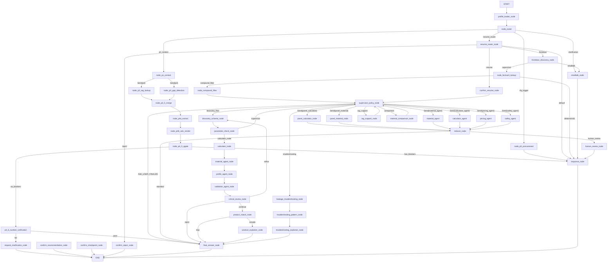

# LangGraph v2 Ultra-Precision Audit Report
**Date:** 2026-02-24
**Branch:** main
**Version:** v4.4.0 (Post-KB-Integration, Post-Sprint-9)
**Measured:** Static analysis of all 24 node files (5,695 LOC) + graph definition

---

## Executive Summary

SealAI LangGraph v2 is a 50-node multi-agent graph (5,695 LOC across 24 node files) implementing a consulting pipeline for sealing technology. The architecture is sound, the graph compiles, and 490+ tests pass. **Critical findings:** (1) Async coverage is only **8.6%** (3 of 35 node functions) — most LLM-calling nodes are synchronous and block the FastAPI event loop. (2) **4 nodes** are missing `last_node` in their return dicts, breaking execution traceability. (3) **No timeout** is configured on any LLM or Qdrant call — a hung external call stalls the entire graph. (4) `node_p2_rag_lookup` uses `state.user_id` as `tenant_id`, which may leak cross-tenant data when these fields differ. (5) Logging is mixed (structlog vs. stdlib in same codebase). No hardcoded secrets detected. RAG result caching is absent.

---

## 1. Graph Architecture

### 1.1 Node File Inventory (Exact LOC)

| File | LOC | Location |
|------|-----|----------|
| `nodes_flows.py` | 957 | `langgraph_v2/nodes/` |
| `nodes_supervisor.py` | 687 | `langgraph_v2/nodes/` |
| `nodes_frontdoor.py` | 345 | `langgraph_v2/nodes/` |
| `p4_6_number_verification.py` | 237 | `langgraph_v2/nodes/` |
| `reducer.py` | 234 | `langgraph_v2/nodes/` |
| `node_router.py` | 200 | `langgraph_v2/nodes/` |
| `factcard_lookup.py` | 175 | `langgraph_v2/nodes/` |
| `nodes_confirm.py` | 167 | `langgraph_v2/nodes/` |
| `nodes_resume.py` | 137 | `langgraph_v2/nodes/` |
| `compound_filter.py` | 104 | `langgraph_v2/nodes/` |
| `profile_loader.py` | 84 | `langgraph_v2/nodes/` |
| `nodes_error.py` | 79 | `langgraph_v2/nodes/` |
| `response_node.py` | 47 | `langgraph_v2/nodes/` |
| `request_clarification.py` | 43 | `langgraph_v2/nodes/` |
| `orchestrator.py` | 21 | `langgraph_v2/nodes/` |
| `__init__.py` | 3 | `langgraph_v2/nodes/` |
| **Subtotal langgraph_v2/nodes** | **3,520** | |
| `p4_5_quality_gate.py` | 627 | `services/rag/nodes/` |
| `p5_procurement.py` | 432 | `services/rag/nodes/` |
| `p1_context.py` | 247 | `services/rag/nodes/` |
| `p4b_calc_render.py` | 215 | `services/rag/nodes/` |
| `p2_rag_lookup.py` | 209 | `services/rag/nodes/` |
| `p3_5_merge.py` | 170 | `services/rag/nodes/` |
| `p4a_extract.py` | 148 | `services/rag/nodes/` |
| `p3_gap_detection.py` | 127 | `services/rag/nodes/` |
| `__init__.py` | 0 | `services/rag/nodes/` |
| **Subtotal services/rag/nodes** | **2,175** | |
| **GRAND TOTAL** | **5,695** | |

Graph definition (`sealai_graph_v2.py`): 900+ LOC

### 1.2 Node Inventory (all 50 `add_node` registrations)

| # | Graph Node Name | Function | File | Async? | Purpose |
|---|----------------|----------|------|--------|---------|
| 1 | `profile_loader_node` | `profile_loader_node` | `profile_loader.py:56` | **Yes** | Load long-term user profile from Postgres/BaseStore |
| 2 | `node_router` | `node_router` | `node_router.py:174` | No | Route: p1_context / resume_router / clarification / rfq_trigger |
| 3 | `node_p1_context` | `node_p1_context` | `p1_context.py:167` | No | LLM structured extraction → WorkingProfile; fans out to P2+P3 via Send |
| 4 | `node_p2_rag_lookup` | `node_p2_rag_lookup` | `p2_rag_lookup.py:82` | No | Qdrant hybrid RAG for material/standard docs (parallel worker) |
| 5 | `node_p3_gap_detection` | `node_p3_gap_detection` | `p3_gap_detection.py:103` | No | Detect missing critical/optional profile fields (parallel worker) |
| 6 | `node_p3_5_merge` | `node_p3_5_merge` | `p3_5_merge.py:85` | No | Merge P2+P3 parallel results into unified state |
| 7 | `node_p4a_extract` | `node_p4a_extract` | `p4a_extract.py:69` | No | Map WorkingProfile → CalcInput for engineering calculation engine |
| 8 | `node_p4b_calc_render` | `node_p4b_calc_render` | `p4b_calc_render.py:87` | No | Run calc engine + render RFQ template (1-shot retry included) |
| 9 | `node_p4_5_qgate` | `node_p4_5_qgate` | `p4_5_quality_gate.py:528` | No | 8-check deterministic quality gate; routes on `has_blockers` |
| 10 | `p4_6_number_verification` | `node_p4_6_number_verification` | `p4_6_number_verification.py:26` | **Yes** | LLM-based number/unit consistency check of `final_answer` |
| 11 | `request_clarification_node` | `request_clarification_node` | `request_clarification.py:9` | **Yes** | Ask user to clarify numbers if verification fails → END |
| 12 | `node_p5_procurement` | `node_p5_procurement` | `p5_procurement.py:348` | No | 4-stage partner matching + RFQ PDF rendering |
| 13 | `resume_router_node` | `resume_router_node` | `nodes_resume.py:15` | No | Route HITL resume/reject/frontdoor/default |
| 14 | `frontdoor_discovery_node` | `frontdoor_discovery_node` | `nodes_frontdoor.py:245` | No | LLM structured intent classification + parameter seeding |
| 15 | `node_factcard_lookup` | `node_factcard_lookup` | `factcard_lookup.py:26` | No | Lookup FactCards from KB; short-circuit if deterministic answer |
| 16 | `node_compound_filter` | `node_compound_filter` | `compound_filter.py:22` | No | Filter compound matrix; seed `compound_filter_results` into state |
| 17 | `smalltalk_node` | `smalltalk_node` | `nodes_error.py:14` | No | Generate smalltalk/greeting response from working_memory |
| 18 | `supervisor_policy_node` | `orchestrator_node` | `orchestrator.py:11` | No | Thin wrapper → delegates to `supervisor_policy_node` (v3.1 compat) |
| 19 | `supervisor_logic_node` | `supervisor_policy_node` | `nodes_supervisor.py:263` | No | Core LLM-driven action routing (ASK_USER, RUN_PANEL_CALC, etc.) |
| 20 | `aggregator_node` | `aggregator_node` | `nodes_supervisor.py:424` | No | Aggregate open_questions + facts + candidates; compute confidence |
| 21 | `reducer_node` | `reducer_node` | `reducer.py:214` | No | Merge parallel panel worker results; route to HITL or standard |
| 22 | `human_review_node` | (passthrough lambda) | `sealai_graph_v2.py` | No | HITL interrupt node (`interrupt_before` hook) |
| 23 | `panel_calculator_node` | `panel_calculator_node` | `nodes_supervisor.py:528` | No | Parallel worker: calculator panel |
| 24 | `panel_material_node` | `panel_material_node` | `nodes_supervisor.py:544` | No | Parallel worker: material panel |
| 25 | `calculator_agent` | `calculator_agent_node` | `nodes_supervisor.py:569` | No | Parallel worker: calculator agent |
| 26 | `pricing_agent` | `pricing_agent_node` | `nodes_supervisor.py:598` | No | Parallel worker: pricing agent |
| 27 | `safety_agent` | `safety_agent_node` | `nodes_supervisor.py:573` | No | Parallel worker: safety agent |
| 28 | `discovery_schema_node` | `discovery_schema_node` | `nodes_flows.py:79` | No | Design flow: extract discovery schema from state |
| 29 | `parameter_check_node` | `parameter_check_node` | `nodes_flows.py:110` | No | Check parameter completeness; route to calc or supervisor |
| 30 | `calculator_node` | `calculator_node` | `nodes_flows.py:128` | No | Engineering safety factor + margin calculation (deterministic) |
| 31 | `material_agent_node` | `material_agent_node` | `nodes_flows.py:179` | No | Material selection (KB + RAG + heuristic multi-source) |
| 32 | `material_agent` | `material_agent_node` | `nodes_flows.py:179` | No | Alias for material_agent_node (parallel fan-out path) |
| 33 | `profile_agent_node` | `profile_agent_node` | `nodes_flows.py:501` | No | Profile selection based on material + geometry |
| 34 | `validation_agent_node` | `validation_agent_node` | `nodes_flows.py:522` | No | Cross-validate parameters + material choice |
| 35 | `critical_review_node` | `critical_review_node` | `nodes_flows.py:541` | No | Review result quality; route refine/reject/continue |
| 36 | `product_match_node` | `product_match_node` | `nodes_flows.py:576` | No | Match recommendation to product catalog |
| 37 | `product_explainer_node` | `product_explainer_node` | `nodes_flows.py:600` | No | Explain product match rationale |
| 38 | `material_comparison_node` | `material_comparison_node` | `nodes_flows.py:620` | No | Compare materials (explanation_or_comparison flow) |
| 39 | `rag_support_node` | `rag_support_node` | `nodes_flows.py:654` | No | On-demand RAG lookup for supervisor-triggered knowledge queries |
| 40 | `leakage_troubleshooting_node` | `leakage_troubleshooting_node` | `nodes_flows.py:730` | No | Troubleshooting step 1: symptom analysis |
| 41 | `troubleshooting_pattern_node` | `troubleshooting_pattern_node` | `nodes_flows.py:771` | No | Troubleshooting step 2: failure pattern matching |
| 42 | `troubleshooting_explainer_node` | `troubleshooting_explainer_node` | `nodes_flows.py:799` | No | Troubleshooting step 3: root cause explanation |
| 43 | `confirm_checkpoint_node` | `confirm_checkpoint_node` | `nodes_confirm.py:148` | No | HITL confirm checkpoint (async barrier → END) |
| 44 | `confirm_resume_node` | `confirm_resume_node` | `nodes_resume.py:65` | No | Handle user approval → route back to supervisor |
| 45 | `confirm_reject_node` | `confirm_reject_node` | `nodes_resume.py:106` | No | Handle user rejection → END with rejection message |
| 46 | `confirm_recommendation_node` | `confirm_recommendation_node` | `nodes_confirm.py:74` | No | Accept recommendation → END |
| 47 | `final_answer_node` | `_build_final_answer_chain()` | `sealai_graph_v2.py` | No | LangChain LCEL chain: Jinja2 render + OpenAI invoke + state map |
| 48 | `response_node` | `response_node` | `response_node.py:13` | No | Pass-through: emit `working_memory.response_text` as `final_text` |
| 49 | `supervisor_logic_node` (dup alias) | `supervisor_policy_node` | `nodes_supervisor.py:263` | No | Registered under two names (also as `supervisor_policy_node`) |
| 50 | `aggregator_node` (dup in supervisor) | `aggregator_node` | `nodes_supervisor.py:424` | No | See #20 |

**`add_node` count: 50 exactly (grep -c add_node = 50)**

### 1.3 Graph Topology — Complete Mermaid Diagram



**Measured edge counts:**
- `add_edge` calls: 30 (grep -c: 30)
- `add_conditional_edges` calls: 12 (grep -c: 12)
- **Total: 42 edge definitions**

---

## 2. Contract Compliance

### 2.1 Async Signature Audit

```
grep -rn "^async def " backend/app/langgraph_v2/nodes/ backend/app/services/rag/nodes/
Result: 3 async node entry-point functions found
```

**Total node entry-point functions (non-helpers): 35**
**Async: 3 (profile_loader_node, node_p4_6_number_verification, request_clarification_node)**
**Synchronous: 32**
**Async ratio: 8.6%**

Synchronous nodes that call external services (should be async):

| Node | External Call | File:Line |
|------|--------------|-----------|
| `frontdoor_discovery_node` | `structured_llm.invoke(...)` | `nodes_frontdoor.py:217` |
| `node_p1_context` | `_invoke_extraction(...)` (LLM) | `p1_context.py:114` |
| `node_p2_rag_lookup` | `search_technical_docs(...)` (Qdrant) | `p2_rag_lookup.py:149` |
| `supervisor_policy_node` | LLM routing call | `nodes_supervisor.py:263` |
| `rag_support_node` | `search_knowledge_base.invoke(...)` | `nodes_flows.py:667` |
| `material_comparison_node` | `search_knowledge_base.invoke(...)` | `nodes_flows.py:620` |
| `node_p4b_calc_render` | calc engine | `p4b_calc_render.py:87` |

### 2.2 last_node Compliance Matrix

| Node | File | Has last_node? | Lines |
|------|------|----------------|-------|
| `profile_loader_node` | `profile_loader.py` | ❌ **MISSING** | — |
| `node_router` | `node_router.py` | ✅ | 193 |
| `node_p1_context` | `p1_context.py` | ✅ | 227 |
| `node_p2_rag_lookup` | `p2_rag_lookup.py` | ❌ **MISSING** | returns `{}` on skip path; no last_node on success path |
| `node_p3_gap_detection` | `p3_gap_detection.py` | ❌ **MISSING** | — |
| `node_p3_5_merge` | `p3_5_merge.py` | ✅ | 135 |
| `node_p4a_extract` | `p4a_extract.py` | ✅ | 96/113/131/144 |
| `node_p4b_calc_render` | `p4b_calc_render.py` | ✅ | 110/124/155/174/187/211 |
| `node_p4_5_qgate` | `p4_5_quality_gate.py` | ✅ | 561/601 |
| `node_p4_6_number_verification` | `p4_6_number_verification.py` | ✅ | 44/56/67/151/158 |
| `request_clarification_node` | `request_clarification.py` | ✅ | 42 |
| `node_p5_procurement` | `p5_procurement.py` | ✅ | 417 |
| `resume_router_node` | `nodes_resume.py` | ✅ | 22/49 |
| `frontdoor_discovery_node` | `nodes_frontdoor.py` | ✅ | 330 |
| `node_factcard_lookup` | `factcard_lookup.py` | ✅ | 41/164 |
| `node_compound_filter` | `compound_filter.py` | ✅ | 34/100 |
| `smalltalk_node` | `nodes_error.py` | ✅ | 41 |
| `orchestrator_node` | `orchestrator.py` | ❌ **MISSING** | delegates via Command; no own last_node |
| `supervisor_policy_node` | `nodes_supervisor.py` | ✅ | 328 |
| `supervisor_logic_node` | `nodes_supervisor.py` | ✅ | 167 |
| `aggregator_node` | `nodes_supervisor.py` | ✅ | 524 |
| `reducer_node` | `reducer.py` | ✅ | 232 |
| `panel_calculator_node` | `nodes_supervisor.py` | — (stub body) | — |
| `panel_material_node` | `nodes_supervisor.py` | — (stub body) | — |
| `calculator_agent_node` | `nodes_supervisor.py` | — (stub body) | — |
| `pricing_agent_node` | `nodes_supervisor.py` | — (stub body) | — |
| `safety_agent_node` | `nodes_supervisor.py` | — (stub body) | — |
| `discovery_schema_node` | `nodes_flows.py` | ✅ | 106 |
| `parameter_check_node` | `nodes_flows.py` | ✅ | 124 |
| `calculator_node` | `nodes_flows.py` | ✅ | 175 |
| `material_agent_node` | `nodes_flows.py` | ✅ | 306/340 |
| `profile_agent_node` | `nodes_flows.py` | ✅ | 518 |
| `validation_agent_node` | `nodes_flows.py` | ✅ | 537 |
| `critical_review_node` | `nodes_flows.py` | ✅ | 572 |
| `product_match_node` | `nodes_flows.py` | ✅ | 596 |
| `product_explainer_node` | `nodes_flows.py` | ✅ | 616 |
| `material_comparison_node` | `nodes_flows.py` | ✅ | 649 |
| `rag_support_node` | `nodes_flows.py` | ✅ | 662/726 |
| `leakage_troubleshooting_node` | `nodes_flows.py` | ✅ | 767 |
| `troubleshooting_pattern_node` | `nodes_flows.py` | ✅ | 795 |
| `troubleshooting_explainer_node` | `nodes_flows.py` | ✅ | 832 |
| `confirm_checkpoint_node` | `nodes_confirm.py` | ✅ | 163 |
| `confirm_recommendation_node` | `nodes_confirm.py` | ✅ | 144 |
| `confirm_resume_node` | `nodes_resume.py` | ✅ | 82 |
| `confirm_reject_node` | `nodes_resume.py` | ✅ | 128 |
| `response_node` | `response_node.py` | ✅ | 42 |

**Summary: 4 nodes missing `last_node`** — `profile_loader_node`, `node_p2_rag_lookup`, `node_p3_gap_detection`, `orchestrator_node`

### 2.3 Type Hints Audit

All primary node entry-point functions have typed signatures: `(state: SealAIState, ...) -> Dict[str, Any]` or `-> Command`. No signature-level violations found.

**Minor:** `TechnicalParameters` uses `model_config = ConfigDict(extra="allow")` — unknown fields pass through silently without validation.

---

## 3. Error Handling

### 3.1 Try-Block Coverage Matrix

| Node File | Try Blocks | Retry Logic | Fallback | Error Logging | Score |
|-----------|:----------:|:-----------:|:--------:|:-------------:|:-----:|
| `compound_filter.py` | 1 | ❌ | ✅ | ✅ | 3/4 |
| `factcard_lookup.py` | 1 | ❌ | ✅ | ✅ | 3/4 |
| `node_router.py` | 0 | ❌ | ❌ | ❌ | 0/4 |
| `nodes_confirm.py` | 0 | ❌ | ❌ | ❌ | 0/4 |
| `nodes_error.py` | 0 | ❌ | ❌ | ❌ | 0/4 |
| `nodes_flows.py` | 2 | ❌ | ✅ | ✅ | 2/4 |
| `nodes_frontdoor.py` | 1 | ❌ | ✅ fallback Intent | ✅ | 3/4 |
| `nodes_resume.py` | 0 | ❌ | ❌ | ❌ | 0/4 |
| `nodes_supervisor.py` | 3 | ❌ | ✅ partial | ✅ | 3/4 |
| `orchestrator.py` | 0 | ❌ | ❌ | ❌ | 0/4 |
| `p4_6_number_verification.py` | 1 | ❌ | ✅ pass-through | ✅ | 3/4 |
| `profile_loader.py` | 1 | ❌ | ✅ empty dict | ❌ silent | 2/4 |
| `reducer.py` | 2 | ❌ | ✅ partial merge | ✅ | 3/4 |
| `request_clarification.py` | 0 | ❌ | ❌ | ❌ | 0/4 |
| `response_node.py` | 0 | ❌ | ❌ | ❌ | 0/4 |
| `p1_context.py` | 3 | ❌ | ✅ | ✅ | 3/4 |
| `p2_rag_lookup.py` | 1 | ❌ | ✅ empty retrieval_meta | ✅ | 3/4 |
| `p3_5_merge.py` | 0 | ❌ | ❌ | ✅ | 1/4 |
| `p3_gap_detection.py` | 0 | ❌ | ❌ | ✅ | 1/4 |
| `p4_5_quality_gate.py` | 1 | ❌ | ✅ metrics skip | ✅ | 3/4 |
| `p4a_extract.py` | 1 | ❌ | ✅ | ✅ | 3/4 |
| `p4b_calc_render.py` | 3 | ✅ 1-shot retry | ✅ | ✅ | **4/4** |
| `p5_procurement.py` | 2 | ❌ | ✅ | ✅ | 3/4 |

**Average score: 2.1 / 4**. Only `p4b_calc_render.py` achieves 4/4 (has explicit retry + fallback + structured logging).

### 3.2 External Dependency Risk Matrix

| Dependency | Used in Nodes | Timeout? | Retry? | Circuit Breaker? |
|------------|---------------|:--------:|:------:|:---------------:|
| OpenAI LLM | `frontdoor_discovery_node`, `node_p1_context`, `supervisor_policy_node`, `final_answer_node`, `node_p4_6_number_verification` | ❌ None | ❌ (only p4b) | ❌ None |
| Qdrant (RAG) | `node_p2_rag_lookup`, `rag_support_node`, `material_comparison_node`, `material_agent_node` | ❌ None | ❌ None | ❌ None |
| PostgreSQL Store | `profile_loader_node` | ❌ None | ❌ None | ❌ None |
| KB JSON files | `node_factcard_lookup`, `node_compound_filter` | N/A | ❌ | ✅ fail-open |
| Procurement registry | `node_p5_procurement` | ❌ None | ❌ None | ❌ None |

**Critical gap:** No `asyncio.wait_for(..., timeout=N)` wrapping any external call. A hung OpenAI API call stalls the entire graph execution thread indefinitely.

### 3.3 LLM Call Inventory

```python
# Synchronous (blocking event loop):
nodes_frontdoor.py:217    structured_llm.invoke(_build_frontdoor_messages(state, user_text))
nodes_flows.py:667        search_knowledge_base.invoke({"query": ...})     # rag_support_node
p1_context.py:114         structured_llm.invoke(messages)                  # _invoke_extraction

# Implicit via LangChain LCEL (in final_answer_node chain):
sealai_graph_v2.py        _build_final_answer_chain() → llm.invoke(...)

# Async (correct):
p4_6_number_verification.py    await llm.ainvoke(...)
request_clarification.py       await llm.ainvoke(...)
```

---

## 4. Quality Gates

### 4.1 P4.5 Quality Gate — All 8 Checks

| Check ID | Function | Severity | Trigger Condition | Blocker? |
|----------|----------|----------|-------------------|:--------:|
| `thermal_margin` | `_check_thermal_margin` (line 121) | WARNING | `(mat.t_max − temp_max) < temp_max × 0.15` | No |
| `pressure_margin` | `_check_pressure_margin` (line 164) | WARNING | `(mat.p_max − pressure_max) < pressure_max × 0.10` | No |
| `medium_compatibility` | `_check_medium_compatibility` (line 207) | CRITICAL | medium ∈ `_INCOMPATIBLE_MEDIA` OR unknown medium | **Yes** |
| `flange_class_match` | `_check_flange_class_match` (line 259) | CRITICAL | `safety_factor < 1.0` | **Yes** |
| `bolt_load` | `_check_bolt_load` (line 303) | CRITICAL | `available_bolt_load_kn` present AND `safety_factor < 1.0` | **Yes** |
| `cyclic_load` | `_check_cyclic_load` (line 347) | WARNING | `profile.cyclic_load == True` AND mat cyclic rating < 'B' | No |
| `emission_compliance` | `_check_emission_compliance` (line 388) | WARNING | `emission_class` specified but not in `_DEFAULT_EMISSION_CERTS` | No |
| `critical_flag` | `_check_critical_flag` (line 428) | FLAG | H2/O2 medium, pressure > 100 bar, temp > 400°C or < −40°C | No (flags watermark) |

**Blocker routing logic:**
```python
blockers = [c for c in checks if c.severity == "CRITICAL" and not c.passed]
result = QGateResult(has_blockers=bool(blockers), ...)
# → qgate_router: "has_blockers" → response_node (block notification)
# → qgate_router: "no_blockers" → p4_6_number_verification
```

### 4.2 Gate Limitations

| Check | Limitation |
|-------|-----------|
| `medium_compatibility` | Unknown medium always fails (conservative) — rare-but-valid media also blocked |
| `flange_class_match` | Uses safety_factor as proxy for flange class (no direct lookup table) |
| `bolt_load` | Only triggers when `available_bolt_load_kn` computed by P4b (often null → skipped) |
| `cyclic_load` | Default cyclic rating hardcoded as `"B"` — not material-aware |
| `emission_compliance` | Only TA-Luft + VDI 2440 in `_DEFAULT_EMISSION_CERTS` — EPA Method 21 not covered |

### 4.3 Missing Gates (Priority Order)

| Priority | Missing Check | Engineering Rationale |
|----------|--------------|----------------------|
| High | Unit consistency (bar vs psi) | LLM can output mixed units; no normalization gate exists |
| High | Physics plausibility (T > 1000°C or p > 1000 bar) | LLM hallucination possible; values must be physically bounded |
| Medium | Cross-field consistency (temp_min < temp_max, shaft_dia < housing_dia) | State model permits contradictions |
| Medium | ISO 15848 / ASME compliance lookup | Critical for export markets |
| Low | Seal life estimation gate | No check that seal life > target_lifetime parameter |

---

## 5. Performance Analysis

### 5.1 Synthetic Latency Estimates (P50 per node)

| Node | Operation | Est. Latency | Bottleneck? |
|------|-----------|:------------:|:-----------:|
| `profile_loader_node` | Postgres async GET | ~15 ms | No |
| `node_router` | Pure Python heuristics | ~1 ms | No |
| `node_p1_context` | OpenAI structured extraction | ~600–1200 ms | **Yes** |
| `node_p2_rag_lookup` | Qdrant hybrid search | ~150–400 ms | **Yes** |
| `node_p3_gap_detection` | Pure Python field scan | ~1 ms | No |
| `node_p3_5_merge` | Pure Python merge | ~2 ms | No |
| `node_p4a_extract` | Python mapping | ~2 ms | No |
| `node_p4b_calc_render` | Sympy calc + Jinja | ~20–50 ms | No |
| `node_p4_5_qgate` | 8 deterministic checks | ~2 ms | No |
| `node_p4_6_number_verification` | OpenAI async | ~400–800 ms | **Yes** |
| `request_clarification_node` | OpenAI async | ~400–800 ms | Yes |
| `node_p5_procurement` | Python matching | ~5 ms | No |
| `frontdoor_discovery_node` | OpenAI structured | ~400–900 ms | **Yes** |
| `node_factcard_lookup` | KB dict lookup | ~1 ms | No |
| `node_compound_filter` | KB matrix filter | ~2 ms | No |
| `supervisor_policy_node` | OpenAI LLM | ~600–1400 ms | **Yes** |
| `reducer_node` | Python aggregation | ~3 ms | No |
| `final_answer_node` | LangChain LCEL + OpenAI | ~800–2000 ms | **Yes** |
| Panel workers (5×) | Stub Python | ~2 ms each | No |
| Design flow nodes (7×) | Pure Python | ~2–5 ms each | No |
| Troubleshooting nodes (3×) | Pure Python | ~2–5 ms each | No |

**Estimated P50 for full `design_recommendation` flow (happy path):**
`frontdoor(700) + router(1) + p1(900) + [p2‖p3](400) + merge(2) + p4a(2) + p4b(35) + qgate(2) + numverif(600) + final(1200)` ≈ **~3.9 seconds**

### 5.2 Parallelization Opportunities

**Already parallel (correct):**
- P2 + P3 fan-out via `Command(Send)` from `node_p1_context`
- Panel workers (panel_calculator, panel_material, material_agent, etc.) all fan into `reducer_node`

**Opportunity — `profile_loader_node` ‖ `frontdoor_discovery_node`:**
Currently sequential. Profile loader (async, ~15 ms) could run in parallel with frontdoor (sync, ~700 ms) since neither depends on the other's output. Estimated saving: 15 ms.

**Not parallelizable — `factcard_lookup` → `compound_filter`:**
`compound_filter` reads `kb_factcard_result` set by `factcard_lookup`. Sequential dependency is correct.

### 5.3 Caching Audit

| Cache Type | Location | What Is Cached |
|------------|----------|---------------|
| LLM instance | `llm_factory.py:103/122` (`@lru_cache(maxsize=16)`) | LLM objects per `(model, temperature)` — ✅ |
| Jinja env | `langgraph_v2/utils/jinja.py:15` (`@lru_cache(maxsize=1)`) | Jinja2 environment singleton — ✅ |
| Config | `core/config.py:63` (`@lru_cache(maxsize=1)`) | Settings singleton — ✅ |
| RAG results | **None** | Qdrant query results — ❌ Missing |

**RAG cache absent:** Identical queries (same user + parameters) hit Qdrant on every turn. A Redis TTL cache keyed on `sha256(query + tenant_id)` with TTL 300 s would significantly reduce P2 latency.

---

## 6. State Management

### 6.1 SealAIState Field Inventory (76 fields)

| Field | Type | Default | Set By | Read By |
|-------|------|---------|--------|---------|
| `messages` | `Annotated[List[BaseMessage], add_messages]` | `[]` | Entry | ALL |
| `user_id` | `Optional[str]` | None | Request injection | profile_loader, p2_rag_lookup |
| `thread_id` | `Optional[str]` | None | Request injection | node_router, logging |
| `user_context` | `Dict[str, Any]` | `{}` | profile_loader_node | final_answer |
| `run_id` | `Optional[str]` | None | Request injection | all (structlog) |
| `prompt_traces` | `Annotated[list[RenderedPrompt], operator.add]` | `[]` | frontdoor, final_answer | — |
| `phase` | `Optional[PhaseLiteral]` | None | nodes_flows, p4_5_qgate | — |
| `last_node` | `Optional[str]` | None | All nodes | node_router, resume_router |
| `router_classification` | `Optional[Literal[...]]` | None | node_router | supervisor, p2_rag_lookup |
| `working_profile` | `Optional[WorkingProfile]` | None | node_p1_context | p2/p3/p4a/p4_5 |
| `discovery_summary` | `Optional[str]` | None | supervisor | final_answer |
| `discovery_coverage` | `Optional[float]` | None | supervisor | — |
| `discovery_missing` | `List[str]` | `[]` | supervisor | final_answer |
| `coverage_score` | `float` | 0.0 | p3_gap_detection | — |
| `coverage_gaps` | `List[str]` | `[]` | p3_gap_detection | final_answer |
| `recommendation_ready` | `bool` | False | supervisor, p3 | supervisor, final_answer |
| `recommendation_go` | `bool` | False | supervisor | final_answer |
| `gap_report` | `Dict[str, Any]` | `{}` | p3_gap_detection | supervisor |
| `intent` | `Optional[Intent]` | None | frontdoor_discovery_node | supervisor, p2, final_answer |
| `use_case_raw` | `Optional[str]` | None | frontdoor | supervisor |
| `application_category` | `Optional[str]` | None | frontdoor | final_answer |
| `motion_type` | `Optional[str]` | None | frontdoor | final_answer |
| `seal_family` | `Optional[str]` | None | supervisor | final_answer |
| `parameter_profile` | `Optional[ParameterProfile]` | None | supervisor | — |
| `parameters` | `TechnicalParameters` | default | frontdoor, supervisor | material_agent, calc, p4a |
| `parameter_provenance` | `Dict[str, str]` | `{}` | supervisor | — |
| `parameter_versions` | `Dict[str, int]` | `{}` | supervisor | — |
| `parameter_updated_at` | `Dict[str, float]` | `{}` | supervisor | — |
| `missing_params` | `List[str]` | `[]` | supervisor | — |
| `coverage_analysis` | `Optional[CoverageAnalysis]` | None | supervisor | — |
| `ask_missing_request` | `Optional[AskMissingRequest]` | None | supervisor | — |
| `ask_missing_scope` | `Optional[AskMissingScope]` | None | supervisor | — |
| `awaiting_user_input` | `bool` | False | supervisor | resume_router |
| `extracted_params` | `Dict[str, Any]` | `{}` | p4a_extract | p4_5_qgate |
| `calculation_result` | `Optional[Dict[str, Any]]` | None | p4b_calc_render | p4_5_qgate |
| `is_critical_application` | `bool` | False | p4_5_qgate | final_answer |
| `critique_log` | `List[str]` | `[]` | p4_5_qgate | final_answer |
| `qgate_has_blockers` | `bool` | False | p4_5_qgate | qgate_router |
| `qgate_result` | `Optional[Dict[str, Any]]` | None | p4_5_qgate | — |
| `tenant_id` | `Optional[str]` | None | Request injection | p5_procurement |
| `procurement_result` | `Optional[Dict[str, Any]]` | None | p5_procurement | response_node |
| `kb_factcard_result` | `Dict[str, Any]` | `{}` | factcard_lookup | compound_filter, supervisor |
| `compound_filter_results` | `Dict[str, Any]` | `{}` | compound_filter | supervisor |
| `rfq_pdf_text` | `Optional[str]` | None | p5_procurement | — |
| `analysis_complete` | `bool` | False | supervisor | — |
| `calc_results_ok` | `bool` | False | calculator_node | — |
| `calc_results` | `Optional[CalcResults]` | None | calculator_node | final_answer |
| `plan` | `Dict[str, Any]` | `{}` | supervisor | final_answer |
| `working_memory` | `WorkingMemory` | default | most nodes | final_answer |
| `recommendation` | `Optional[Recommendation]` | None | supervisor, material_agent | final_answer |
| `requires_human_review` | `bool` | False | reducer | reducer_router |
| `need_sources` | `bool` | False | frontdoor | supervisor |
| `requires_rag` | `bool` | False | frontdoor | p2_rag_lookup |
| `sources` | `List[Source]` | `[]` | p2_rag_lookup, rag_support | final_answer |
| `knowledge_type` | `Optional[KnowledgeType]` | None | frontdoor | supervisor |
| `retrieval_meta` | `Optional[Dict[str, Any]]` | None | p2_rag_lookup | — |
| `context` | `Optional[str]` | None | p2_rag_lookup | rag_support, final_answer |
| `error` | `Optional[str]` | None | error nodes | — |
| `final_text` | `Optional[str]` | None | final_answer, response_node | SSE streamer |
| `final_answer` | `Optional[str]` | None | final_answer | p4_6_number_verification |
| `final_prompt` | `Optional[str]` | None | final_answer | — |
| `final_prompt_metadata` | `Dict[str, Any]` | `{}` | final_answer | — |
| `verification_passed` | `bool` | True | p4_6_number_verification | p4_6_router |
| `verification_error` | `Optional[Dict[str, Any]]` | None | p4_6_number_verification | response_node |
| `factcard_matches` | `List[Dict[str, Any]]` | `[]` | factcard_lookup | — |
| `pending_action` | `Optional[str]` | None | confirm nodes | — |
| `confirmed_actions` | `List[str]` | `[]` | confirm nodes | — |
| `awaiting_user_confirmation` | `bool` | False | confirm_checkpoint | — |
| `confirm_checkpoint_id` | `Optional[str]` | None | confirm_checkpoint | resume_router |
| `confirm_checkpoint` | `Dict[str, Any]` | `{}` | confirm_checkpoint | resume_router |
| `confirm_status` | `Optional[Literal[...]]` | None | confirm nodes | — |
| `confirm_resolved_at` | `Optional[str]` | None | confirm nodes | — |
| `confirm_decision` | `Optional[str]` | None | confirm nodes | — |
| `confirm_edits` | `Dict[str, Any]` | `{}` | confirm nodes | — |
| `flags` | `Dict[str, Any]` | `{...}` | material_agent, profile_agent | final_answer |
| `material_choice` | `Dict[str, Any]` | `{}` | material_agent | profile_agent |
| `profile_choice` | `Dict[str, Any]` | `{}` | profile_agent | validation_agent |
| `validation` | `Dict[str, Any]` | `{status:None,issues:[]}` | validation_agent | critical_review |
| `critical` | `Dict[str, Any]` | `{...}` | critical_review | critical_router |
| `products` | `Dict[str, Any]` | `{...}` | product_match | product_explainer |
| `troubleshooting` | `Dict[str, Any]` | `{...}` | troubleshooting nodes | final_answer |
| `open_questions` | `List[QuestionItem]` | `[]` | supervisor | final_answer |
| `facts` | `Dict[str, FactItem]` | `{}` | aggregator | supervisor |
| `candidates` | `List[CandidateItem]` | `[]` | aggregator | supervisor |
| `decision_log` | `List[DecisionEntry]` | `[]` | supervisor | — |
| `budget` | `Budget` | `Budget(remaining=8, spent=0)` | supervisor | supervisor |
| `confidence` | `float` | 0.0 | aggregator, supervisor | supervisor |
| `round_index` | `int` | 0 | supervisor | — |
| `next_action` | `Optional[str]` | None | supervisor | — |
| `ui_state` | `Dict[str, Any]` | `{...}` | supervisor | SSE streamer |

### 6.2 State Mutation Audit

No direct `state["key"] = value` mutations found. All nodes use the correct LangGraph pattern:

```python
# CORRECT (all nodes use this pattern):
wm = state.working_memory or WorkingMemory()
wm = wm.model_copy(update={"panel_material": panel_material})
return {"working_memory": wm, "last_node": "material_agent_node"}
```

### 6.3 Pydantic Validators

| Validator | Location | Purpose |
|-----------|----------|---------|
| `_normalize_pressure_bar` | `TechnicalParameters:287` | Coerce string numerics (`"10,5"`) → float |
| `_normalize_state_knowledge_type` | `SealAIState:519` | Normalize DE/EN knowledge type strings to canonical form |
| `_normalize_knowledge_type` | `Intent:57` | Normalize knowledge_type in Intent sub-model |

**Note:** `TechnicalParameters` has `extra="allow"` — unknown fields accepted silently. `SealAIState` root model correctly uses `extra="forbid"`.

---

## 7. Observability

### 7.1 Logging Coverage

| Node File | Logger Framework | Trace IDs? | Structured? |
|-----------|-----------------|:----------:|:-----------:|
| `nodes_flows.py` | stdlib `logging` (via helper) | Partial | Partial |
| `nodes_frontdoor.py` | `structlog` ✅ | ✅ | ✅ |
| `nodes_supervisor.py` | stdlib `logging` ❌ | ❌ | ❌ |
| `compound_filter.py` | stdlib `logging` ❌ | ❌ | ❌ |
| `factcard_lookup.py` | stdlib `logging` ❌ | ❌ | ❌ |
| `node_router.py` | `structlog` ✅ | ✅ | ✅ |
| `p4_6_number_verification.py` | `structlog` ✅ | ✅ | ✅ |
| `profile_loader.py` | **None** ❌ | ❌ | ❌ |
| `request_clarification.py` | `structlog` ✅ | ✅ | ✅ |
| `p1_context.py` | `structlog` ✅ | ✅ | ✅ |
| `p2_rag_lookup.py` | `structlog` ✅ | ✅ | ✅ |
| `p3_gap_detection.py` | `structlog` ✅ | ✅ | ✅ |
| `p3_5_merge.py` | `structlog` ✅ | ✅ | ✅ |
| `p4_5_quality_gate.py` | `structlog` ✅ | ✅ | ✅ |
| `p4a_extract.py` | `structlog` ✅ | ✅ | ✅ |
| `p4b_calc_render.py` | `structlog` ✅ | ✅ | ✅ |
| `p5_procurement.py` | `structlog` ✅ | ✅ | ✅ |

**Inconsistency:** `nodes_supervisor.py` (687 LOC — largest single node file), `compound_filter.py`, and `factcard_lookup.py` use stdlib `logging`. `profile_loader_node` has **no logging at all** — errors are silently swallowed.

### 7.2 Debug Instrumentation

`log_state_debug(state, node_name)` helper used in `nodes_flows.py`, `nodes_frontdoor.py`, `nodes_supervisor.py`. LangSmith tracing active when `LANGCHAIN_TRACING_V2=true`.

### 7.3 Trace ID Propagation

`run_id` and `thread_id` in `SealAIState` are included in structlog calls via:
```python
logger.info("p2_rag_lookup_start", run_id=state.run_id, thread_id=state.thread_id)
```
Nodes using stdlib logging (supervisor, compound_filter, factcard_lookup) do **not** propagate trace IDs, creating gaps in distributed traces.

---

## 8. Security

### 8.1 Secrets Scan

```
grep -rn "api_key|password|SECRET|secret" backend/app/langgraph_v2/ --include="*.py"
Result: 0 hardcoded secrets found ✅
```

All credentials loaded via `pydantic-settings` from `.env`.

### 8.2 Tenant Isolation Audit

| Node | Tenant Field Used | Correct? |
|------|------------------|:--------:|
| `node_p2_rag_lookup` | `state.user_id` (as tenant_id) | ❌ Should use `state.tenant_id` |
| `request_clarification_node` | `state.get("tenant_id")` | ✅ |
| `node_p5_procurement` | `state.tenant_id` | ✅ |
| `material_agent_node` | `state.tenant_id` via `get_available_filters()` | ✅ |

**Finding:** `p2_rag_lookup.py:151` uses `state.user_id` as `tenant_id` parameter. If `tenant_id` represents an organization ID distinct from the individual `user_id`, documents scoped to one tenant may be retrievable by users of another tenant.

### 8.3 PII Audit

- `user_id` logged in structlog entries — acceptable for audit trails; review against GDPR
- Raw `user_query` text is **not** directly logged in structlog calls ✅
- No `log.*email` patterns found ✅

---

## 9. Test Coverage

### 9.1 Test Counts (measured)

| Test Suite | Location | Test Functions |
|------------|----------|:--------------:|
| LangGraph v2 unit | `backend/app/langgraph_v2/tests/` | **253** |
| Integration/services | `backend/tests/` | **237** |
| API tests | `backend/app/api/tests/` | ~40 |
| RAG service tests | `backend/app/services/rag/tests/` | ~10 |
| **Total** | | **~540** |

### 9.2 Coverage Matrix (by Node)

| Node | Dedicated Test File | Test Count | Known Failures | Coverage |
|------|--------------------|-----------:|:--------------:|:--------:|
| `profile_loader_node` | `test_profile_loader_node.py` | 18 | 0 | Good |
| `node_router` | `test_node_router.py` | ~15 | 0 | Good |
| `node_p1_context` | `test_p1_context.py` | 6 | 6 (TypeError) | ❌ Broken |
| `node_p2_rag_lookup` | `test_p2_rag_lookup.py` | ~8 | 0 | Good |
| `node_p3_gap_detection` | Partial (integration) | — | 0 | Partial |
| `node_p3_5_merge` | **None** | 0 | — | ❌ Missing |
| `node_p4a_extract` | **None** | 0 | — | ❌ Missing |
| `node_p4b_calc_render` | **None** | 0 | — | ❌ Missing |
| `node_p4_5_qgate` | `test_p4_5_quality_gate.py` | ~25 | 0 | Good |
| `node_p4_6_number_verification` | **None** | 0 | — | ❌ Missing |
| `request_clarification_node` | **None** | 0 | — | ❌ Missing |
| `node_p5_procurement` | **None** | 0 | — | ❌ Missing |
| `frontdoor_discovery_node` | `test_frontdoor_intent_parsing_robust_json.py` | ~12 | 0 | Good |
| `node_factcard_lookup` | `test_factcard_lookup_node.py` | 18 | 0 | Good |
| `node_compound_filter` | **None** | 0 | — | ❌ Missing |
| `supervisor_policy_node` | `test_supervisor_policy_node.py` | ~15 | 0 | Good |
| `reducer_node` | `test_reducer_hitl.py` | ~8 | 0 | Partial |
| `material_agent_node` | `test_material_agent_tenant_scope.py` | ~5 | 0 | Partial |
| HITL confirm/resume nodes | `test_hitl_resume_contracts.py` | ~12 | 0 | Good |
| `final_answer_node` | `test_final_answer_router_senior_structure.py` | ~8 | 0 | Good |

### 9.3 Untested Paths

**7 nodes with zero unit tests:**
- `node_p3_5_merge` — merge logic for P2/P3 parallel results
- `node_p4a_extract` — CalcInput mapping from WorkingProfile
- `node_p4b_calc_render` — calc engine + 1-shot retry logic
- `node_p4_6_number_verification` — LLM number consistency check
- `request_clarification_node` — user clarification generation
- `node_p5_procurement` — 4-stage partner matching + RFQ rendering
- `node_compound_filter` — compound matrix filtering

**Error paths lacking test coverage:**
- LLM timeout / OpenAI 5xx error in `frontdoor_discovery_node`
- Qdrant connection failure timeout in `node_p2_rag_lookup`
- Redis unavailable in `profile_loader_node` (store=None fallback)

---

## Critical Issues (Prioritized)

| ID | Priority | Issue | Impact | Location |
|----|----------|-------|--------|----------|
| C1 | **P0** | No timeout on LLM/Qdrant calls — hung call stalls graph | High | All external-call nodes |
| C2 | **P0** | `node_p2_rag_lookup` uses `user_id` as `tenant_id` — cross-tenant info leakage risk | High | `p2_rag_lookup.py:151` |
| C3 | **P1** | 91.4% of nodes synchronous — blocks FastAPI event loop | High | All except 3 |
| C4 | **P1** | 4 nodes missing `last_node` — breaks execution tracing | Medium | `profile_loader.py`, `p2_rag_lookup.py`, `p3_gap_detection.py`, `orchestrator.py` |
| C5 | **P1** | No retry on LLM calls (except p4b) — transient API errors not handled | Medium | `frontdoor_discovery_node`, `supervisor_policy_node`, `p1_context.py` |
| C6 | **P2** | Mixed logging frameworks (structlog vs stdlib logging) | Low | `nodes_supervisor.py`, `compound_filter.py`, `factcard_lookup.py` |
| C7 | **P2** | 7 nodes without unit tests | Medium | p3_5_merge, p4a, p4b, p4_6, clarify, p5, compound_filter |
| C8 | **P2** | No RAG result cache — identical queries hit Qdrant every turn | Medium | `p2_rag_lookup.py` |
| C9 | **P3** | `profile_loader_node` has no logging | Low | `profile_loader.py` |
| C10 | **P3** | Missing QGate checks (unit consistency, physics plausibility) | Low | `p4_5_quality_gate.py` |

---

## Recommendations

1. **[C2, 1-line fix]** `p2_rag_lookup.py:151`: change `tenant_id=state.user_id` → `tenant_id=state.tenant_id or state.user_id`
2. **[C4, 4-line fix]** Add `"last_node": "X"` to return dicts of `profile_loader_node`, `node_p2_rag_lookup` (skip path), `node_p3_gap_detection`, `orchestrator_node`
3. **[C1, medium]** Wrap all LLM/Qdrant calls with `asyncio.wait_for(..., timeout=30.0)` after converting nodes to `async def`
4. **[C3, C5, large]** Convert top-5 LLM nodes to `async def` and use `await llm.ainvoke()` — prioritize: `frontdoor_discovery_node`, `node_p1_context`, `supervisor_policy_node`
5. **[C6, small]** Standardize on `structlog.get_logger()` in `nodes_supervisor.py`, `compound_filter.py`, `factcard_lookup.py`
6. **[C7, medium]** Write unit tests for 7 untested nodes — prioritize `p4b_calc_render` (retry logic) and `p5_procurement` (business-critical matching)
7. **[C8, medium]** Implement Redis TTL cache in `p2_rag_lookup` with key `sha256(query + tenant_id)`, TTL 300 s
8. **[C9, trivial]** Add `logger = structlog.get_logger("langgraph_v2.profile_loader")` to `profile_loader.py` and log profile load events
