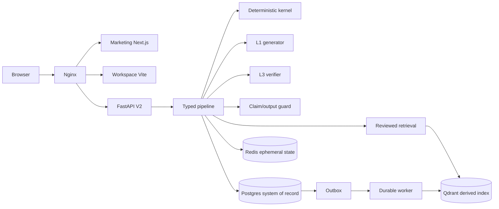

# sealingAI Production Architecture

Status: proposed implementation baseline, 2026-07-09

## Decision Summary

Keep the V2 monorepo and make its boundaries explicit. Do not replace the
current synchronous pipeline with LangGraph. The product's trust model is
stronger when deterministic calculations, reviewed evidence, LLM generation,
verification, and citations are separate typed stages.

Use a durable worker only for work that outlives an HTTP request: outbox
delivery, document ingestion, embedding/index maintenance, memory distillation,
and scheduled retention. A workflow engine such as Temporal or LangGraph may
be evaluated later for multi-day human approval processes. Neither belongs in
the synchronous advisory path today.

## Target Repository Shape

The current repository is retained during migration, but all new code must
move toward these ownership boundaries:

```text
apps/
  marketing-web/       # Next.js public site
  workspace-web/        # Vite authenticated dashboard
services/
  api/                  # FastAPI HTTP/SSE boundary
  worker/               # outbox and document jobs
packages/
  contracts/            # generated OpenAPI/SSE and shared identifiers
  ui/                   # dashboard-only design primitives
  evals/                # seed sets, judges, replay manifests
domain/
  kernel/               # pure calculations and formulas
  knowledge/            # reviewed facts, provenance, matrix
  safety/               # claim guards and tenant policies
infrastructure/
  compose/ nginx/ keycloak/ observability/ backups/
docs/architecture/ adr/ runbooks/
archive/                # retired V1/V10 material, never imported
```

Until the physical move is complete, the mapping is `frontend/` to
`apps/marketing-web`, `frontend-v2/` to `apps/workspace-web`, and
`backend/sealai_v2/` to `services/api` plus `domain/` subpackages. The move is
mechanical only after import-purity and contract tests cover the boundary.

## Runtime Flow



The kernel is the only source of numbers. Qdrant is rebuildable and never the
system of record. Redis is a cache and working-memory layer, not a durable
business record. Every user-visible technical claim must carry evidence status,
source/provenance, and coverage or uncertainty.

## Non-Negotiable Contracts

1. `TurnState` is the only state crossing pipeline stages. Each stage declares
   its inputs, outputs, failure mode, and trace fields.
2. `KernelResult` is pure and serializable. LLM code cannot call kernel
   internals through an untyped escape hatch or write numeric claims directly.
3. `GroundingFact` requires source, review status, version, and scope. Draft
   facts can inform review queues but cannot correct or block as reviewed truth.
4. API responses and SSE frames are versioned. Preview tokens are explicitly
   non-authoritative; only the final guarded frame is authoritative.
5. Tenant identity is derived server-side from the verified token and applied to
   every Postgres and memory query.
6. Background work is idempotent with a stable job key, retry policy, dead
   letter state, and visible operational metrics.
7. A production deploy is allowed only from a clean reviewed commit with an
   adjudicated replay matching the served tree and L1 model.

## Implementation Order

### P0: Release integrity

The repository now contains the first P0 slice: V2-only build/push workflow,
immutable image labels, exact commit/tree verification, dirty-worktree refusal,
active eval gate, and V2 host recovery. Next P0 work is adding a staging
environment approval and making the three required CI checks cover both web
surfaces.

### P1: Boundary extraction

Split the large pipeline module into stage objects around a typed `TurnState`.
Keep behavior byte-compatible while moving orchestration, prompt assembly,
kernel invocation, guard evaluation, and persistence behind ports. Add contract
tests at each port before moving files.

### P2: Durable operations

Promote the existing outbox and worker code to a real `services/worker`
container with lease ownership, retries, dead letters, metrics, and a startup
probe. Remove request-scoped `asyncio.create_task` for work that must survive a
process restart.

### P3: Contract and UI synchronization

Generate TypeScript API types from the FastAPI OpenAPI document and publish a
versioned SSE framing contract. Replace the live `frontend-v2/dist` bind mount
with an immutable dashboard artifact/image after staging proves the cutover.

### P4: Observability and security

Use OpenTelemetry for HTTP, database, queue, and worker traces. Keep LangSmith
optional for LLM-specific spans and redact prompts, tokens, secrets, and tenant
content by policy. Add retention, backup-restore, tenant-isolation, and abuse
tests to the release gate.

## Definition Of Done

The migration is complete when one documented CI/CD path builds and promotes
the exact artifact, no production path can deploy a dirty tree or retired V1
service, the worker survives restarts, API types are generated rather than
duplicated, the kernel remains pure, eval gates are blocking, and a rollback
can be proven from the ledger without manual reconstruction.
