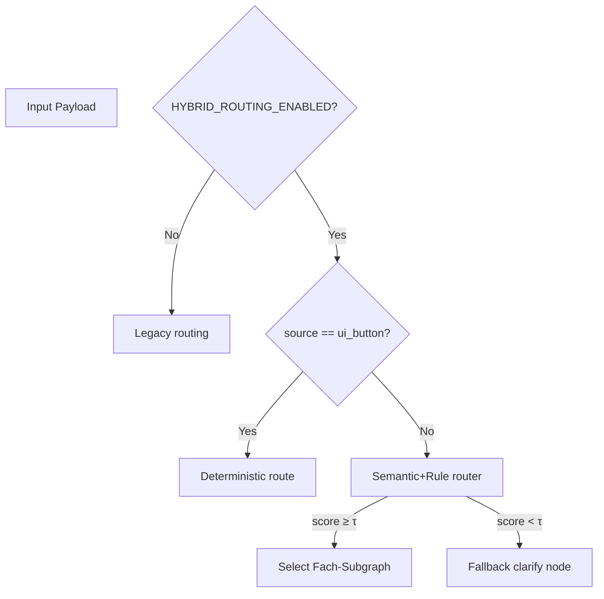

# Hybrid Button-Intent Routing – RFC (PR #1)

Autor: Codex (GPT-5) · Datum: 2025-09-26 · Status: Entwurf (Plan-Gate)

Dieses RFC dokumentiert den Ist-Zustand der SealAI-LangGraph-Integration und beschreibt das Zielbild für ein hybrides Routing mit Button-Overrides, Confidence-Schwellen und Telemetrie. Die Umsetzung erfolgt in den nachgelagerten PRs (#2 Backend, #3 Frontend, #4 Observability), nachdem dieses Dokument gemergt wurde.

---

## 1. Überblick & Ziele
- **Scope**: Backend (LangGraph Supervisor/Consult), WebSocket/SSE Runner, Frontend Chat-UI, Config, Telemetrie, Rollout.
- **Business-Ziel**: Anwender*innen sollen Fach-Buttons (Werkstoff, Profil, Validierung) sowie Freitext nutzen können. Der Supervisor orchestriert deterministische Pfade, semantisches Routing und fallback-orientierte Klärungsdialoge.
- **Technische Ziele**:
  - UI-Buttons müssen den passenden Fach-Subgraph ohne zusätzliche Intent-Klassifikation aktivieren.
  - Freitext-Anfragen werden über einen konfigurierbaren Router (Confidence ≥ τ) in Fachpfade geleitet oder erhalten eine Klärungsfrage + Button-Vorschläge.
  - Session- und Nutzerpräferenzen (z. B. `last_agent`) werden im Redis-Checkpointer persistiert, beeinflussen aber nur Empfehlungen.
  - Feature-Flag `HYBRID_ROUTING_ENABLED` deaktiviert die neuen Flows vollständig.
  - Telemetrie liefert einheitliche Events für Routing-Entscheidungen.

---

## 2. Ist-Analyse

### 2.1 Graph & Nodes
- **Supervisor-Graph** (`backend/app/services/langgraph/graph/supervisor_graph.py`):
  - Einstieg `router` → LLM-basierte Klassifikation (`material_select` vs. `llm`) via `intent_router.classify_intent` (`graph/intent_router.py`).
  - `complexity_router` unterscheidet „simple“ vs. „complex“; einfache Fragen gehen direkt in `simple_response`.
  - Komplexe Pfade binden den Consult-Subgraph (`graph/consult/build.py`) ein.
  - Tools: `ltm_search`, `ltm_store` für Qdrant-LTM.
  - Logging über `wrap_node_with_logging`/`log_branch_decision`.
- **Consult-Graph** (`graph/consult/build.py`):
  - Pipelines für `intake`, `profile`, `extract`, `domain_router`, `compute`, `deterministic_calc`, `calc_agent`, `ask_missing`, `rag`, `recommend`, `summarize`.
  - Lite-Router (`smalltalk_node`) und heuristische Parameterauswertung, aber keine Button-Übersteuerung.
  - UI-Events (Form-Öffnung etc.) werden via WebSocket an den Client gepusht.
- **MVP-Graph** (`graph/mvp_graph.py`) existiert weiterhin als Legacy-Fallback, wird aber weder im Frontend noch im Default verwendet.

### 2.2 Runner / Entry Points
- **WebSocket** (`backend/app/api/v1/endpoints/chat_ws.py` → `services/chat/ws_handler.py`):
  - `WebSocketChatHandler` authentifiziert via Keycloak (`guard_websocket`), setzt Rate-Limits (Redis), schreibt Messages nach STM (`consult/memory_utils.py`).
  - `stream_supervised` (`ws_streaming.py`) ruft `_ensure_graph`, kompiliert bei Bedarf `supervisor`, `consult` oder `mvp` und cached `app.state.graph_async`.
  - Cancel/Ping bereits implementiert; Graph-Wahl via Payload `graph` (Fallback: `config.graph_builder`).
- **SSE** (`backend/app/api/v1/endpoints/langgraph_sse.py`): optionaler Streaming-Pfad mit identischer Graph-Komposition.
- **REST-Fallback** (`backend/app/api/v1/endpoints/ai.py`) und Debug-Invoke (`consult_invoke`) existieren, sollten mittel-/langfristig entfernt werden.

### 2.3 Memory / State
- Redis-basierte Kurzzeit-Historie (`consult/memory_utils.py`) + optionale Summary als erste Systemnachricht.
- Checkpointer (`redis_lifespan.py`, `postgres_lifespan.py`) liefern Saver-Instanzen; Supervisor/Consult nutzen derzeit keinen zusätzlichen State außer `messages`, `params`, `phase`.
- Kein `last_agent` oder vergleichbare Präferenz gespeichert.

### 2.4 Konfiguration & Flags (heute)
- `GRAPH_BUILDER` (Default `supervisor`) bestimmt initial kompilierten Graph (`backend/app/main.py` Startup).
- WebSocket-Config zieht Werte aus ENV (`ws_config.py`), u. a. `WS_MODE`, `WS_STREAM_NODES`, `WS_COALESCE_*`.
- Kein Feature-Flag oder YAML-basiertes Routing-Config.

### 2.5 Frontend Chat
- Next.js Dashboard (`frontend/src/app/dashboard/components/Chat`):
  - `useChatWs` (Frontend) sendet aktuell immer `graph: 'consult'`, d. h. Supervisor wird umgangen.
  - Keine Quick-Action-Buttons; UI reagiert auf `sealai:ui_action` Events (Form öffnen, Calc anzeigen).
  - Streaming/Cancel/Rate-Limit-Feedback vorhanden, aber kein Intent-Signal.
- Keine Kontextvorschläge oder Button-Payloads Richtung Backend.

### 2.6 Repo-Struktur & Abweichungen
- Zielstruktur (aus Briefing): Backend unter `backend/app/...`, Frontend unter `frontend/src/...` → stimmt grob.
- Abweichungen: Legacy-Dateien (z. B. `ChatContainer.tsx.save.*`, `node_modules/` eingecheckt, `archive/*`), fehlende `docs/runbooks/` Struktur.
- Observability beschränkt sich auf Standard-Logs; Telemetrie-Modul (`tools/telemetry.py`) schreibt nur Redis-Counter ohne Events.

---

## 3. Problemstellung
1. **Keine deterministischen Button-Flows**: Frontend sendet keine Button-Intents, Backend kennt keine Override-Logik.
2. **Supervisor umgangen**: UI erzwingt `graph='consult'`, wodurch Planner/Router ausfallen.
3. **Kein Confidence-gestütztes Routing**: Nur LLM Intent Router (binary) ohne konfigurierbares τ.
4. **Fallback UX fehlt**: Keine standardisierte Klärungsfrage oder Button-Suggestion bei Unsicherheit.
5. **State-Persistenz lückenhaft**: `last_agent` oder Nutzerpräferenzen werden nicht gespeichert.
6. **Telemetry unzureichend**: Keine Events mit Feldern wie `intent_candidate`, `confidence`, `feature_flag_state`.
7. **Feature-Flag fehlt**: Neue Logik nicht isolierbar → hohes Rollout-Risiko.

---

## 4. Zielbild (Hybrid Routing)

### 4.1 High-Level Architektur
```mermaid
flowchart LR
  UI[Chat UI]
  Buttons[Buttons\nWerkstoff/Profil/Validierung]
  WS[/WebSocket API/]
  Supervisor[Supervisor/Planner]
  Router[Semantic+Rule Router]
  DomainA[Fach-Subgraph\nWerkstoff]
  DomainB[Fach-Subgraph\nProfil]
  DomainC[Fach-Subgraph\nValidierung]
  Fallback[Fallback Agent\n(Clarify + Suggestions)]

  Buttons -->|intent_seed, source=ui_button| WS
  UI -->|Freitext| WS
  WS --> Supervisor
  Supervisor -->|override| DomainA
  Supervisor -->|override| DomainB
  Supervisor -->|override| DomainC
  Supervisor --> Router
  Router -->|score ≥ τ| DomainA
  Router -->|score ≥ τ| DomainB
  Router -->|score ≥ τ| DomainC
  Router -->|score < τ| Fallback
  Fallback --> Supervisor
  Supervisor -->|respond| UI
```

### 4.2 Supervisor/Planner
- Zustandsobjekt erweitern (`intent_seed`, `route_source`, `last_agent`, `candidate_intents`, `confidence`).
- Entry-Node Logik:
  1. **Feature-Flag prüfen**: Wenn `HYBRID_ROUTING_ENABLED` false → bestehende Pfade.
  2. **Button-Override**: Wenn `source == 'ui_button'` + `intent_seed` gesetzt → deterministische Transition (kein Router-Aufruf).
  3. **History-Hint**: Falls `last_agent` in Checkpoint + Freitext ähnlich vergangenem Intent (z. B. heuristisch per cosine) → nur Vorschlagswert, kein Auto-Routing.
  4. **Semantic Router**: Für Freitext Anfragen (siehe 4.3) → returns `intent_candidate`, `confidence`.
  5. **Fallback Node**: Bei Score < τ → Schreibe `route='fallback'`, generiere Klärungsfrage und Buttons.

- Planner bleibt ein StateGraph, aber mit zusätzlichen Node-Typen:
  - `button_dispatcher` (neuer deterministischer Node).
  - `semantic_router` (LLM/embedding + Regeln, konfigurierbar).
  - `fallback_node` (LLM generiert Klartext + Buttons, sendet UI-Events).
  - `domain_planner` (Delegation an Subgraph + Logging + Telemetrie).

### 4.3 Router & Confidence Flow

- Router kombiniert:
  - Regelsatz (Regex, Buttons-Vergleich, Domain-Priorität).
  - Embedding-Ähnlichkeit (z. B. E5 + Cosine) vs. Domain-Templates.
  - Optional: LLM-Klassifikation als Tiebreaker.
- Threshold τ aus `config/routing.yml` (Default 0.72).
- Router liefert Ranking/Top-K, Telemetrie erfasst `intent_candidate`, `confidence`, `alternatives` (optional).

### 4.4 Subgraphs & Delegation
- Fach-Subgraphs reusen existierende Consult-Knoten, aber werden modularisiert:
  - `domain_router` transformiert zu `domain_runtime` mit pluggable specs.
  - Buttons können „Validierung-only“ Pfade triggern (Skips: `rag`, `recommend` → direkter `validate_answer`).
- Fallback Agent: generiert Klärungsfrage, erfragt fehlende Infos, sendet Buttons (z. B. „Werkstoff auswählen“, „Profil spezifizieren“).

### 4.5 UI Buttons & Vorschläge
- Quick Actions unterhalb der Chat-Composer Box, horizontal scrollbar (mobil) und disabled während Streaming.
- Button payload sendet: `{ intent: 'werkstoff', confidence: 0.95, source: 'ui_button', metadata?: {...} }`.
- Backend Fallback node sendet Event `{ event: 'fallback', suggestions: [...] }`; UI rendert Kontext-Buttons bis Interaktion erfolgte.

---

## 5. UX-Triggerpunkte
- **Initial Screen**: Zeigt Standard-Buttons sobald `HYBRID_ROUTING_ENABLED` aktiv + WebSocket connected.
- **Während Streaming**: Buttons disabled; Anzeige von Loading-State.
- **Fallback-Signal**: `routing_fallback` Event → UI zeigt kontextuelle Buttons, optional Info-Text („Ich brauche genauere Angaben …“).
- **History Suggestion**: Wenn `last_agent` vorhanden, UI zeigt dezenten Hinweis („Zuletzt hast du den Profil-Assistenten genutzt“).
- **Cancel**: Cancel-Button bleibt, setzt Streaming false und reaktiviert Buttons.

---

## 6. Konfiguration & Feature-Flags
- **Environment**:
  - `HYBRID_ROUTING_ENABLED` (Default `0`/false). Wenn false → sämtliche neuen Nodes übersprungen, UI blendet Buttons aus.
  - `ROUTING_CONF_PATH` (Default `config/routing.yml`). Relative Pfade gegen Repo-Root.
- **config/routing.yml** (Schema):
  ```yaml
  version: 1
  confidence_threshold: 0.72  # τ
  min_delta: 0.08             # optional: Abstand zu Top-2
  embeddings_model: "intfloat/multilingual-e5-base"
  intents:
    werkstoff:
      synonyms: [material, werkstoff, "ptfe", "hnbr"]
      buttons:
        label: "Werkstoff wählen"
        tooltip: "Finde den passenden Werkstoff"
    profil:
      synonyms: [profil, bauform, nutprofil]
      buttons:
        label: "Profil konfigurieren"
    validierung:
      synonyms: [validierung, prüfe, check]
      buttons:
        label: "Validierung"
  fallback:
    prompt_template: "prompts/hybrid/fallback.jinja2"
  ```
- Backend lädt YAML bei Startup (lazy reload via file watcher optional), injiziert Werte in Router Node.
- Tests mocken YAML-Inhalt.

---

## 7. Telemetrie & Observability
- **Pflicht-Events** (alle via gemeinsamer Emissions-Funktion, z. B. `emit_routing_event(event_name, payload)`):
  - `routing_decision`
  - `routing_fallback`
  - `ui_button_selected`
- **Pflichtfelder** (wenn verfügbar):
  - `thread_id`, `user_id`, `source` (`ui_button`, `nlp`, `history`)
  - `intent_candidate`, `intent_final`
  - `confidence` (float)
  - `next_node` (Name des nächsten Graph-Knotens) **oder** `fallback=true`
  - `duration_ms` (Messpunkt: Router Start → Entscheidung)
  - `feature_flag_state` (bool)
  - Optional: `alternatives` (Top-K Intents), `button_context`, `history_match_score`
- **Integration**:
  - Logging über `ws_log` erweitern + JSON-structured logs → OpenSearch/ELK.
  - LangSmith/OpenTelemetry Hooks (`instrumentation.py`) ergänzen.
  - Dashboard (PR #4) nutzt Events für Fehlrouting-Rate, Fallback-Anteil, Time-to-First-Useful-Step, CSAT Korrelation.

---

## 8. Deliverables & Umsetzungsplan

| PR | Inhalt | Kernaufgaben |
|----|--------|--------------|
| #1 | **Dieses RFC** | Ist-Analyse, Zielbild, Plan. Keine Codeänderungen außer Dokument. |
| #2 | **Backend** | Supervisor/Router Refactor, Button-Override Nodes, YAML-Config Loader, Feature-Flag, Fallback Node, Tests (`pytest`), `docs/runbooks/hybrid_routing_backend.md`. |
| #3 | **Frontend** | Quick-Action Buttons, Kontext-Vorschläge, Payload Schema, Flag-Check (z. B. via `/api/v1/system/config`), Runbook `docs/runbooks/hybrid_routing_frontend.md`. |
| #4 | **Observability & Rollout** | Telemetrie-Emitter, Dashboards, Staged Rollout Plan, KPIs, Rollback-Anleitung in `docs/runbooks/hybrid_routing_rollout.md`. |

Weitere Tasks:
- Legacy Bereinigung schrittweise (separate PR-Serie nach Hybrid-Routing, sofern nötig).
- CI-Erweiterung (Tests für neue Router, Frontend Lint/Build) spätestens in PR #2/#3.

---

## 9. Migration & Rollout
1. **Vorbereitung**
   - YAML-Config erzeugen (`config/routing.yml`) mit Domain-Teams abstimmen.
   - Feature-Flag default `false`, Tests für beide Zustände.
2. **PR #2**
   - Backend deploy mit Flag `false` → kein Verhalten geändert.
   - Smoke-Tests (Graph compile, Button override unit tests) in CI.
3. **PR #3**
   - Frontend deploy (Flag `false`) → Buttons hidden; Regressionstests (chat baseline) laufen.
4. **Staged Enablement**
   - Stage `HYBRID_ROUTING_ENABLED=true` in Staging, nur intern.
   - Monitor Telemetrie (routing_decision Confidence-Verteilung, Fallback-Quote).
   - Rollout auf Produktion mit Flagramp (z. B. 10% Traffic, dann 50%, dann 100%).
5. **Rollback**
   - Flag `false` → revert zum alten Verhalten ohne Hotfix.
   - YAML kann verbleiben, Router fallbacked auf Legacy branch.

---

## 10. Risiken & Gegenmaßnahmen
- **Confidence-Miss** (Score falsch niedrig): Fallback loops → Mit `min_delta`, `history` heuristics, manuellen Buttons abfangen.
- **Button-Spam**: Rate-Limiting pro Intent-Action (Client & Server) + Debounce.
- **State-Drift**: `last_agent` Persistenz sauber invalidieren, TTL im Checkpointer.
- **Observability-Lücken**: Telemetrie-Emitter mit Try/Except aber Logging auf Fehler.
- **Regression bei Flag=off**: Tests müssen altbekannte Routen abdecken; Snapshots für Supervisor/Consult.

---

## 11. Offene Punkte für Review
- Bestätigung, dass `config/routing.yml` serverseitig in Docker/K8s ausgeliefert werden kann (ConfigMap Mount?).
- Abstimmung über Speicherort `last_agent` (Checkpoint Metadata vs. dedizierte Redis-Hash).
- Feedback zum Fallback-Dialog (Tonality, Pflichtfelder) – ggf. UX-Team involvieren.

---

## 12. Zusammenfassung
Dieses RFC schafft die Grundlage für ein konsistentes Hybrid-Routing. Nach Merge startet PR #2 mit Backend-Implementierung unter strikten Feature-Flag- und Test-Guidelines, gefolgt von Frontend und Observability. Telemetrie und Rollout-Prozesse sichern die Einführung ab; Rollback via Flag bleibt jederzeit möglich.
