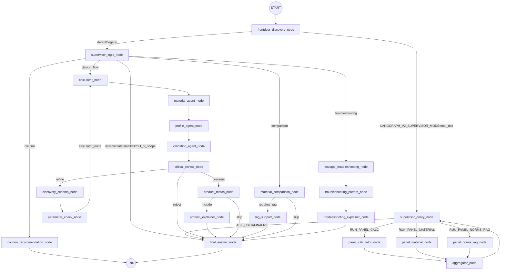

# SealAI LangGraph v2 Audit (Phase 1 - Read-only)

## Scope
- LangGraph v2 supervisor pattern, Redis checkpointer/memory, RAG, Jinja2 prompts, SSE wiring, Keycloak user binding.
- Code focus: `backend/app/langgraph_v2/*`, `backend/app/api/v1/endpoints/langgraph_v2.py`, `backend/app/api/v1/endpoints/state.py`, `frontend/src/*`.

## Architecture Map (v2)

### Graph entry/exit and conditional routing

Evidence:
- Node registration + routing: `backend/app/langgraph_v2/sealai_graph_v2.py:466-599`.
- Supervisor entry switch (`LANGGRAPH_V2_SUPERVISOR_MODE`): `backend/app/langgraph_v2/sealai_graph_v2.py:424-505`.

### Where memory/checkpointer/store are initialized
- Checkpointer creation + Redis setup: `backend/app/langgraph_v2/utils/checkpointer.py:37-100`.
- Graph uses checkpointer: `backend/app/langgraph_v2/sealai_graph_v2.py:612-614`.
- Checkpointer identity is `user_id|thread_id`: `backend/app/langgraph_v2/sealai_graph_v2.py:626-649`.
- API endpoints inject the checkpointer into config: `backend/app/api/v1/endpoints/langgraph_v2.py:68-78` and `backend/app/api/v1/endpoints/state.py:127-138`.
- Long-term memory (Qdrant LTM) is separate from Redis STM: `backend/app/services/memory/memory_core.py:1-88`.

### Where RAG is invoked
- Supervisor panel (MAI-DxO loop): `panel_norms_rag_node` calls RAG tool: `backend/app/langgraph_v2/nodes/nodes_supervisor.py:486-526`.
- Comparison flow: `rag_support_node` calls RAG tool: `backend/app/langgraph_v2/nodes/nodes_flows.py:334-388`.
- RAG tool -> orchestrator: `backend/app/langgraph_v2/utils/rag_tool.py:1-76` uses `hybrid_retrieve`.
- Qdrant retrieval + external fallback: `backend/app/services/rag/rag_orchestrator.py:125-236`.

### Where Jinja2 is rendered
- Jinja env + StrictUndefined: `backend/app/langgraph_v2/utils/jinja.py:11-37`.
- Final answer draft uses `final_answer_router.j2`: `backend/app/langgraph_v2/nodes/nodes_flows.py:521-523`.
- Final prompt selects `final_answer_*_v2.j2`: `backend/app/langgraph_v2/sealai_graph_v2.py:168-381`.
- Legacy/alt final template in unused node: `backend/app/langgraph_v2/nodes/nodes_validation.py:22-70`.

### thread_id/chat_id/user_id flow (Backend + Frontend)
- Client chat id stored per user session in browser: `frontend/src/lib/useChatThreadId.ts:6-64`.
- Frontend proxy requires Bearer token and passes `chat_id`: `frontend/src/app/api/chat/route.ts:67-109`.
- Backend v2 endpoint uses Keycloak user only (no client user_id): `backend/app/api/v1/endpoints/langgraph_v2.py:386-415`.
- State endpoint also binds user_id from Keycloak: `backend/app/api/v1/endpoints/state.py:141-195`.
- Checkpointer uses `user_id|thread_id` in config: `backend/app/langgraph_v2/sealai_graph_v2.py:626-649`.

## Evidence-Based Audit

### A) Supervisor pattern
- Two supervisor decision nodes exist, switched by env flag (`supervisor_logic_node` vs `supervisor_policy_node`): `backend/app/langgraph_v2/sealai_graph_v2.py:471-533`.
- Routing is deterministic and unit-tested for the legacy supervisor route: `backend/app/langgraph_v2/tests/test_sealai_graph_v2_supervisor_routing.py:7-50`.
- MAI-DxO loop uses `supervisor_policy_node` with explicit action routing: `backend/app/langgraph_v2/nodes/nodes_supervisor.py:205-294` and `backend/app/langgraph_v2/sealai_graph_v2.py:522-538`.
- Workers do not directly emit user-facing messages outside supervisor gating except `confirm_recommendation_node` writing `final_text` (still behind supervisor route): `backend/app/langgraph_v2/nodes/nodes_confirm.py:69-148` and `backend/app/langgraph_v2/sealai_graph_v2.py:507-519`.

### B) Memory/Persistence
- Redis checkpointer with `asetup()` and memory fallback: `backend/app/langgraph_v2/utils/checkpointer.py:57-100`.
- Checkpointer thread id is `user_id|thread_id` for isolation: `backend/app/langgraph_v2/sealai_graph_v2.py:634-649`.
- State/parameter updates are Keycloak-scoped: `backend/app/api/v1/endpoints/state.py:141-259`.
- Separate STM store (Redis) is keyed only by `chat_id` (not user-bound): `backend/app/services/memory/conversation_memory.py:18-55`.

### C) RAG
- RAG can be triggered by supervisor policy (panel) or by comparison flow flag (`requires_rag`): `backend/app/langgraph_v2/nodes/nodes_supervisor.py:205-259` and `backend/app/langgraph_v2/nodes/nodes_flows.py:300-388`.
- `requires_rag` is set by frontdoor intent: `backend/app/langgraph_v2/nodes/nodes_frontdoor.py:326-340`.
- RAG tool calls Qdrant with 5s timeout and external fallback: `backend/app/services/rag/rag_orchestrator.py:125-236`.
- Existing test ensures the formatter doesn't emit fake `intern` sources: `backend/app/langgraph_v2/tests/test_rag_tool_no_intern_source.py:1-8`.

### D) Jinja2 / Final rendering
- Jinja2 is rendered with `StrictUndefined` but `autoescape=False`: `backend/app/langgraph_v2/utils/jinja.py:16-24`.
- Two separate final-answer template paths exist in v2 (`final_answer_router.j2` + `final_answer_*_v2.j2`) and a legacy `final_answer_v2.j2` in a node not wired into the graph: `backend/app/langgraph_v2/nodes/nodes_flows.py:521-523`, `backend/app/langgraph_v2/sealai_graph_v2.py:168-381`, `backend/app/langgraph_v2/nodes/nodes_validation.py:22-70`.

### E) Backend <-> Frontend SSE wiring
- Backend SSE emits `token`, `confirm_checkpoint`, `done`, `error` and keepalive comments: `backend/app/api/v1/endpoints/langgraph_v2.py:150-384`.
- Frontend SSE client reads `token` and `confirm_checkpoint`, stops on `done` or `error`: `frontend/src/lib/useChatSseV2.ts:91-158`.
- Proxy enforces Bearer token and forwards SSE stream: `frontend/src/app/api/chat/route.ts:82-154`.
- `client_msg_id` is generated on client and propagated but only echoed back in `done` (no server-side idempotency): `frontend/src/lib/useChatSseV2.ts:99-105`, `backend/app/api/v1/endpoints/langgraph_v2.py:276-283`.

### F) Observability
- Request IDs logged and returned in headers: `backend/app/api/v1/endpoints/langgraph_v2.py:386-415`.
- `run_id` generated and stored in metadata: `backend/app/langgraph_v2/sealai_graph_v2.py:634-646`.

### Doppelte/Legacy Pfade
- Legacy v2 graph remains in repo: `backend/app/langgraph_v2/sealai_graph_v2_legacy.py:1-120`.
- Backup of state endpoint accepts client-supplied user_id: `backend/app/api/v1/endpoints/state.py.backup:83-134`.
- Backup RAG ingest script still present: `backend/app/services/rag/rag_ingest.py.backup:1-79`.

## Gap List (vs. "perfekt verdrahtet")

Severity legend: S0=security/data leak, S1=correctness, S2=maintainability, S3=nice-to-have.

### S1
1) **Nicht "genau ein Supervisor"**: Zwei Supervisor-Entry-Varianten (legacy vs. MAI-DxO) werden per env gewaehlt. Das ist nicht single-source-of-truth und erschwert deterministisches Routing-Testing ueber den gesamten Graph. Evidence: `backend/app/langgraph_v2/sealai_graph_v2.py:471-533`.
2) **RAG nicht ausschliesslich supervisor-gated**: `rag_support_node` wird im Vergleichs-Flow ohne explizite Supervisor-Entscheidung aktiviert (nur ueber `requires_rag` Flag). Das weicht vom "Supervisor-only RAG" Prinzip ab. Evidence: `backend/app/langgraph_v2/nodes/nodes_flows.py:300-388`.
3) **SSE Idempotency / Resume fehlt**: `client_msg_id` wird nicht fuer De-duplication verwendet; es gibt kein `id:`/`Last-Event-ID` fuer Reconnect/Resume. Evidence: `backend/app/api/v1/endpoints/langgraph_v2.py:150-384`, `frontend/src/lib/useChatSseV2.ts:91-158`.

### S2
1) **Mehrere Final-Answer Pfade im Code**: `final_answer_router.j2`, `final_answer_*_v2.j2` und ein ungenutzter `final_answer_v2.j2` (via `nodes_validation`) existieren parallel. Risiko: Drift, unklare "source of truth". Evidence: `backend/app/langgraph_v2/nodes/nodes_flows.py:521-523`, `backend/app/langgraph_v2/sealai_graph_v2.py:168-381`, `backend/app/langgraph_v2/nodes/nodes_validation.py:22-70`.
2) **Legacy/Backup Dateien mit unsicheren Patterns**: `state.py.backup` enthaelt client-supplied `user_id` Parameter; trotz Nichtnutzung erhoeht das die Gefahr eines versehentlichen Imports/Deployments. Evidence: `backend/app/api/v1/endpoints/state.py.backup:83-134`.
3) **STM Redis keying ohne user_id**: `conversation_memory` nutzt ausschliesslich `chat_id` als Schluessel. Wenn dieses Modul im v2 Stack aktiv wuerde, droht Cross-User Leakage bei Chat-ID-Kollisionen. Evidence: `backend/app/services/memory/conversation_memory.py:18-55`.

### S3
1) **Prompt injection hardening**: Jinja nutzt `autoescape=False` und uebernimmt `user_text` direkt in Prompts. Fuer LLM-Prompts ueblich, aber ohne klaren "trusted/untrusted" Hinweis oder escape-Strategy dokumentiert. Evidence: `backend/app/langgraph_v2/utils/jinja.py:16-24`.
2) **Observability: Trace IDs im SSE**: Request IDs sind vorhanden, aber keine per-event Trace IDs/Run IDs in SSE payloads. Evidence: `backend/app/api/v1/endpoints/langgraph_v2.py:276-283`.

## Fix-Plan (Phase 2 - kleine Commits)

1) **Supervisor Single-Entry (S1)**
   - Was: Entferne legacy-Entry oder reduziere auf einen Supervisor-Pfad (MAI-DxO), inkl. eindeutiger Router-Tests.
   - Warum: "Exactly one supervisor" + deterministische Testbarkeit.
   - Tests: Update/extend `backend/app/langgraph_v2/tests/test_sealai_graph_v2_supervisor_routing.py` und add policy-router tests for `LANGGRAPH_V2_SUPERVISOR_MODE`.

2) **RAG nur ueber Supervisor (S1)**
   - Was: Verschiebe `rag_support_node` Trigger in supervisor policy loop (z.B. `RUN_PANEL_NORMS_RAG`/`RUN_PANEL_COMPARISON_RAG`) oder setze `requires_rag` nur im Supervisor.
   - Warum: RAG Tooling kontrolliert vom Orchestrator (MAI-DxO).
   - Tests: Add unit test asserting RAG node only reachable via supervisor policy path.

3) **SSE Idempotency/Resume (S1)**
   - Was: SSE `id:` mit `client_msg_id` oder server `request_id`, optional `Last-Event-ID` handling; server-side de-dup check to avoid double state updates.
   - Warum: production-grade reconnect/resume + stable streaming.
   - Tests: Add pytest for SSE payload includes `id` and for duplicate `client_msg_id` behavior.

4) **Final-Answer Path cleanup (S2)**
   - Was: Remove/retire unused `nodes_validation`/`final_answer_v2.j2` path or document; consolidate routing to one final path.
   - Warum: single source of truth for final answer templates.
   - Tests: Update template routing tests as needed.

5) **Memory keying guard (S2)**
   - Was: If `conversation_memory` remains in use, prefix with `user_id|chat_id` or explicitly mark it legacy-only.
   - Warum: eliminate cross-user leakage risk.
   - Tests: Unit test for STM key derivation.

## Empfehlung: "Ist es perfekt verdrahtet?"
**Nein.**
Belege: zwei Supervisor-Entry-Pfade (`backend/app/langgraph_v2/sealai_graph_v2.py:471-533`), RAG in comparison flow ohne Supervisor-Entscheidung (`backend/app/langgraph_v2/nodes/nodes_flows.py:300-388`), fehlende SSE idempotency/resume (`backend/app/api/v1/endpoints/langgraph_v2.py:150-384`, `frontend/src/lib/useChatSseV2.ts:91-158`).

### Was ich aendern wuerde (Richtung MAI-DxO + Best Practices)
- Consolidate auf einen Supervisor-Entry (MAI-DxO), legacy entfernen oder klar isolieren.
- RAG als explizites Supervisor-Tool (Policy-Action) statt "flow-level flag".
- SSE: `id:` + server-side de-dup mit `client_msg_id`, optional `Last-Event-ID` resume.
- Entferne/archiviere Legacy/Backup files mit client-supplied user_id und ungenutzten final-answer paths.
- (Optional) STM Keying mit `user_id|chat_id` in Redis.
