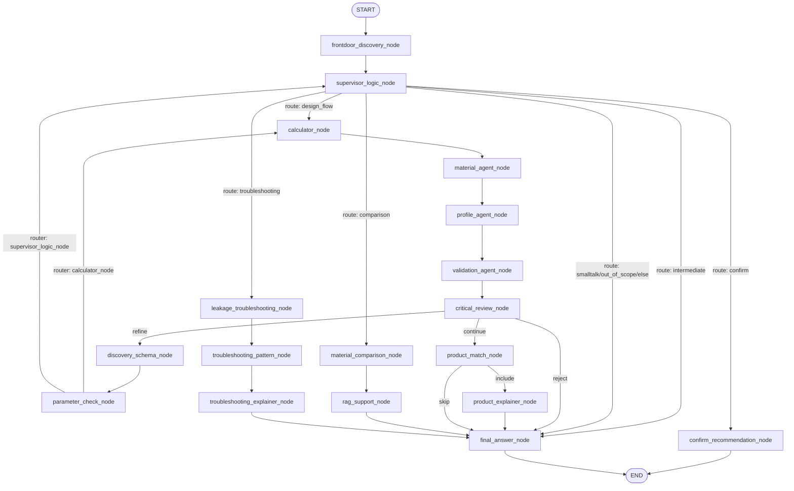

# Phase 1 — Graph Overview (LangGraph v2)

## Graph Location / Build

- Graph wird gebaut und kompiliert in `backend/app/langgraph_v2/sealai_graph_v2.py`. Node‑Registration und Edges: `backend/app/langgraph_v2/sealai_graph_v2.py:345-441`.  
- Runtime lädt den Graph via `get_sealai_graph_v2` im SSE Endpoint: `backend/app/api/v1/endpoints/langgraph_v2.py:19-20` und `backend/app/langgraph_v2/sealai_graph_v2.py:457-463`.

## Mermaid Diagram (ist‑Stand)

## Node Table (Name → Funktion → Datei)

| Node Name (Graph) | Funktion | Datei |
|---|---|---|
| `frontdoor_discovery_node` | Intent‑Vorfilter + Param‑Extraktion (LLM+Regex) | `backend/app/langgraph_v2/nodes/nodes_frontdoor.py:119-298` |
| `supervisor_logic_node` | Routing‑Entscheid, `recommendation_go` Heuristik | `backend/app/langgraph_v2/nodes/nodes_supervisor.py:30-39` |
| `discovery_schema_node` | Required‑Param Set + missing list | `backend/app/langgraph_v2/nodes/nodes_flows.py:41-69` |
| `parameter_check_node` | Flags setzen, ob missing leer ist | `backend/app/langgraph_v2/nodes/nodes_flows.py:72-87` |
| `calculator_node` | Simple Heuristik‑Berechnung, `calc_results` füllen | `backend/app/langgraph_v2/nodes/nodes_flows.py:90-147` |
| `material_agent_node` | Materialauswahl via LLM | `backend/app/langgraph_v2/nodes/nodes_flows.py` (**MISSING line refs wegen truncation im Scan; Funktion existiert in Datei und ist im Graph registriert: `backend/app/langgraph_v2/sealai_graph_v2.py:355`.**) |
| `profile_agent_node` | Profil‑Auswahl | `backend/app/langgraph_v2/nodes/nodes_flows.py` (**MISSING line refs**) |
| `validation_agent_node` | Validierungs‑LLM | `backend/app/langgraph_v2/nodes/nodes_flows.py` (**MISSING line refs**) |
| `critical_review_node` | Critical status, refine/reject routing | `backend/app/langgraph_v2/nodes/nodes_flows.py:188-221` |
| `product_match_node` | Dummy Product‑Matching | `backend/app/langgraph_v2/nodes/nodes_flows.py:224-244` |
| `product_explainer_node` | Begründung für Products | `backend/app/langgraph_v2/nodes/nodes_flows.py:247-264` |
| `material_comparison_node` | Materialvergleich Prompt+LLM | `backend/app/langgraph_v2/nodes/nodes_flows.py:267-296` |
| `rag_support_node` | RAG Tool für Normen | `backend/app/langgraph_v2/nodes/nodes_flows.py:299-317` |
| `leakage_troubleshooting_node` | Troubleshooting LLM | `backend/app/langgraph_v2/nodes/nodes_flows.py:320-358` |
| `troubleshooting_pattern_node` | Pattern heuristic | `backend/app/langgraph_v2/nodes/nodes_flows.py:361-386` |
| `troubleshooting_explainer_node` | Troubleshooting Explainer LLM | `backend/app/langgraph_v2/nodes/nodes_flows.py:389-423` |
| `confirm_recommendation_node` | Ask user to confirm go/no‑go | `backend/app/langgraph_v2/nodes/nodes_confirm.py:26-53` |
| `final_answer_node` | Final answer chain (Jinja + ChatOpenAI) | `backend/app/langgraph_v2/sealai_graph_v2.py:238-309` |

